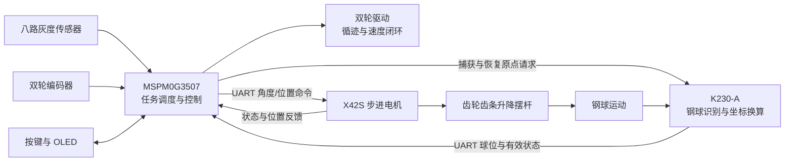

# 车载小球平衡运动控制系统

**让小车沿黑线行驶，同时控制车上摆杆内的钢球停在指定位置。**

项目围绕 H 题车载平衡滚球任务开发：静止时，让钢球从中心依次移动到 `+5 cm`、`-5 cm`；行驶时，在循迹、加减速和转弯过程中保持钢球位置。摄像头测量球的位置，主控计算底盘轮速和摆杆控制量，齿轮齿条机构调整摆杆倾角，使小球形成位置闭环。

仓库包含主控固件、视觉端程序、主机侧逻辑测试，以及机械标定和实车调试记录。项目已形成底盘控制与滚球控制的集成程序；其中静止换点任务有实车稳定运行的文字记录，移动中平衡等任务仍需对当前版本继续整车验证。

## 项目内容与阶段结果

| 任务 | 已实现内容 | 结果与证据 |
|---|---|---|
| 静止换点（T3） | 钢球从 O 点到 `+5 cm`，折返到 `-5 cm` 并稳定 | [项目记录](docs/source-notes/H题_车载平衡滚球运动控制系统_项目需求与实施计划.md)确认实车运行稳定；缺少本版完整计时与轨迹记录 |
| 循迹一圈并停车（T2） | 识线、双轮速度闭环、终点减速与停车 | 控制逻辑有主机测试；当前圈时与停车误差待实车复测 |
| 行驶中保持球位（T4～T6） | 在固定中心或本轮捕获位置保持钢球，补偿底盘加速度影响 | 集成程序与逻辑测试已保留；当前版本待整车验收 |
| 图传与录像（T1） | 独立图传，场外录像与回放 | 已公开程序；仓库未附完整比赛录像 |

## 系统如何工作

TI MSPM0G3507 负责控制与任务调度，K230-A 负责钢球视觉测量，X42S 闭环步进电机通过齿轮齿条升降摆杆一端。两条控制链在主控内协同：底盘负责沿轨迹行驶，滚球环根据视觉反馈和底盘加速度调整摆杆。



一次任务的操作顺序是：人工确认齿条机械下限 → 回到摆杆水平位置 → 选择任务 → 放球并等待有效视觉（T6 另需捕获目标）→ 确认启动 → 完成或故障停止。K230-B 只承担图传，不向主控提供控制反馈。

## 关键设计

### 1. 把静止换点与移动平衡分开控制

T3 的启动摩擦和正、负方向响应不同，因此使用独立控制器：固定角克服起步阻力，再根据位置与速度提前接管，分别处理正向到达和负向稳定。这样能在代码中明确区分“已经经过目标”和“已经在目标附近稳定”。对应实现见 [task3_controller.c](firmware/H_BallBalance_MSPM0G3507/src/tasks/task3_controller.c)。

T4～T6 共用另一条滚球控制链，在位置/速度 PD 外加入底盘加速度前馈，并限制角度与变化幅度。T6 把本轮捕获位置定义为零点，复用同一控制器。对应实现见 [balance_drive_run.c](firmware/H_BallBalance_MSPM0G3507/src/tasks/balance_drive_run.c) 和 [ball_pd.c](firmware/H_BallBalance_MSPM0G3507/src/control/ball_pd.c)。

### 2. 同时处理识线、轮速和执行器响应

底盘以 10 ms 节拍处理灰度偏差、左右轮目标速度、编码器反馈和速度 PID；速度规划限制加速度与加加速度，转弯时限制差速变化。摆杆执行器还要检查命令应答、运行状态和实际位置，不能把“命令已发送”当作“机构已到位”。实现分别位于 [line_drive_service.c](firmware/H_BallBalance_MSPM0G3507/src/services/line_drive_service.c) 与 [stepper_service.c](firmware/H_BallBalance_MSPM0G3507/src/services/stepper_service.c)。

### 3. 给视觉、通信和任务启动设置有效性条件

K230-A 通过带校验、序号和有效标志的二进制帧上报球位；串口中断只接收字节，主循环完成解析。未识别到球时发送无效心跳，主控不会把其中的零坐标当作真实中心。T6 捕获需要稳定单球窗口、匹配请求序号和捕获后的新鲜坐标，才允许进入就绪状态。

运行中保留视觉过期、通信异常、执行器跟随、机械范围和复位保护；移动平衡任务使用 120 ms 视觉新鲜度限制。协议与标定说明见 [K230-A 文档](vision/k230/README.md)，状态切换见 [app_controller.c](firmware/H_BallBalance_MSPM0G3507/src/app/app_controller.c)。

## 公开内容与阅读入口

| 内容 | 路径 | 适合查看的内容 |
|---|---|---|
| 当前主控工程 | [firmware/H_BallBalance_MSPM0G3507](firmware/H_BallBalance_MSPM0G3507) | 主循环、控制器、传感器、通信、状态机和板级配置 |
| 视觉程序 | [vision/k230](vision/k230) | 钢球检测调用、固定/动态原点、像素到毫米换算、双向 UART 协议 |
| 独立图传 | [vision/k230-b-streaming](vision/k230-b-streaming) | K230-B 图传程序，Wi-Fi 参数使用占位值 |
| 主机测试 | [tests](firmware/H_BallBalance_MSPM0G3507/tests) | 协议、传感器、驱动、安全、任务控制等纯逻辑回归 |
| 调试与阶段记录 | [docs/source-notes](docs/source-notes) | 机械标定、控制演进、实机现象和待验证事项 |
| 早期任务工程 | [firmware/task2-legacy](firmware/task2-legacy) | 历史底盘实现，供对照控制逻辑演进 |
| 辅助工具 | [tools](tools) | 蓝牙调参、视觉及 RTSP 工具；当前主控未启用蓝牙调参链路 |

过程文档保留了不同阶段的参数和计划。阅读当前行为时，应先核对参与编译的源码、编译开关和 SysConfig，再查看相应阶段记录；旧文档中的理论圈时和旧版构建结果不代表当前整车性能。

## 查看、测试与部署

仅阅读控制逻辑可从 [主循环](firmware/H_BallBalance_MSPM0G3507/main.c) 和上面的三个设计入口开始。运行或部署需要分别准备主机测试环境、TI 工具链和 K230 开发环境。

| 环境 | 仓库使用的配置 |
|---|---|
| 主控硬件 | MSPM0G3507，LQFP-64；接线和引脚分配见[主工程说明](firmware/H_BallBalance_MSPM0G3507/README.md) |
| TI 工具链 | MSPM0 SDK 2.10.0.04、SysConfig 1.27.1、TI Arm Clang 4.0.4 LTS；工程使用 CCS |
| 主机测试 | Windows、PowerShell 7；脚本当前指定 GCC 路径 `C:\msys64\ucrt64\bin\gcc.exe` |
| 视觉运行 | K230 / CanMV；检测模型和 `deploy_config.json` 需另行放入设备 `/sdcard/mp_deployment_source/`，这两项未包含在本仓库 |

在仓库根目录运行主控逻辑测试：

```powershell
& 'C:\Program Files\PowerShell\7\pwsh.exe' -NoLogo -NoProfile -File .\firmware\H_BallBalance_MSPM0G3507\tests\run_all.ps1
```

**整理副本已有的验证记录为主工程 18 项通过、1 项失败**：失败发生在 `task3_controller` 的命令跟踪状态转换断言，尚未修复；全量脚本遇到该断言会停止，其后的测试曾单独补跑。早期 `task2-legacy` 工程记录为 16 项通过。本次 README 整理没有重新执行这些测试，也没有改动控制算法。

原赛题的时间、停车误差和球位误差要求见[任务要求](docs/source-notes/H题_车载平衡滚球运动控制系统_项目需求与实施计划.md)。当前 T3 诊断控制器取消了总运行超时，现有稳定运行记录不能证明满足原题的 5 秒验收；T4～T6 不设置自动停车时间，经过终点需现场记录。

硬件部署从导入主控 CCS 工程、核对板级配置与编译开始；K230-A 的脚本、模型和配置需单独部署。当前视觉源码的负向毫米拟合修正尚未完成上板复核，历史 CCS 构建通过记录不能替代当前版本的重新构建、烧录和整车验证。具体操作和待测项分别见[主控说明](firmware/H_BallBalance_MSPM0G3507/README.md)与[视觉说明](vision/k230/README.md)。

首次上电或烧录时断开电机主电源或架空车轮，依次确认方向、编码器符号、机械范围和复位制动，再加载机构。软件保护不能代替硬件急停与机械止挡。

## 公开范围与许可

此仓库公开代码和阶段文档，已排除编译输出、个人文档及临时文件，并替换真实 Wi-Fi 参数。当前未附加开源许可证；复用前需确认代码、团队材料及第三方依赖各自的授权范围。
