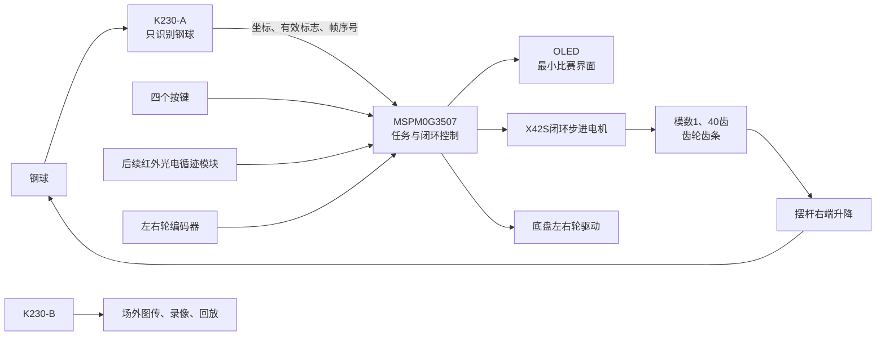

# H题：车载平衡滚球运动控制系统——项目需求与实施计划

> 文档状态：当前工程基线  
> 更新日期：2026-08-01  
> 目标主控：TI MSPM0G3507  
> 当前主工程：`D:\eletri\H_BallBalance_MSPM0G3507`  

## 1. 文档目的

本文用于统一赛题要求、当前机械结构、硬件分工、控制逻辑、任务操作流程和后续固件实施顺序。

后续讨论中如果机械参数、K230协议、循迹传感器或控制参数发生变化，应同步更新本文，并在修改记录中注明变化。旧的 `summary.md` 和 `workspace_ai_handoff.md` 仅作为历史资料；若与本文或目标工程实际源码冲突，以以下事实顺序为准：

1. 目标 CCS 工程当前参与编译的源码和编译开关。
2. 目标工程自己的 SysConfig。
3. CCS 工程元数据和实际构建日志。
4. 赛题 PDF、精确器件资料及板卡资料。
5. 实际机械测量、示波器、逻辑分析仪、串口日志和实车结果。
6. 本文中的估算值、建议值和旧工程经验。

本文中的参数使用以下状态：

- **已确认**：用户已经确认，可作为当前设计输入。
- **暂定**：当前可以用于建模或编写框架，但必须在实物完成后复测。
- **待确定**：尚无足够信息，不得写死到最终固件。

## 2. 赛题原始目标

### 2.1 总体任务

制作一辆搭载平衡滚球装置的循线小车。小车沿黑色环形路线行驶，摆杆控制机构在小车静止或运动时控制钢球到达并稳定在指定位置。

系统至少包含：

- 轮式小车及车载电池；
- 带凹槽的摆杆；
- 摆杆角度控制机构；
- 直径约 1 cm 的钢球；
- 采用摄像头的钢球位置检测；
- 红外光电循迹装置；
- 启动按键和不大于 2 英寸的显示装置；
- 能实时显示、录像和回放的图传装置。

### 2.2 六项测试要求

| 任务 | 赛题要求 | 验收指标 |
|---|---|---|
| 任务1 | 图传发送模块稳固安装在小车上，场外接收、显示、完整录像并可回放 | 画面稳定实时，完整覆盖钢球运动过程 |
| 任务2 | 小车从 A 点按键启动，沿黑线顺时针行驶一圈并停到 A 点 | 总时间不超过 20 s；停车偏差不超过 2 cm |
| 任务3 | 小车静止，钢球从中心点 O 移动到 +5 cm，折返到 -5 cm 并稳定 | 总时间不超过 5 s；两个目标位置最大误差绝对值不超过 1 cm |
| 任务4 | 小车从 A 点启动，沿黑线顺时针行驶并通过 B 点，钢球保持在 O 点 | A 到 B 不超过 8 s；钢球误差绝对值不超过 1 cm |
| 任务5 | 小车从 A 点启动，顺时针行驶一圈并通过 A 点，钢球保持在 O 点 | 一圈不超过 30 s；钢球误差绝对值不超过 1 cm |
| 任务6 | 钢球放在摆杆任意指定位置，小车顺时针行驶一圈并通过 A 点 | 一圈不超过 30 s；钢球误差绝对值不超过 1 cm |

任务3当前参与编译源码采用以下到达判据；用户已确认当前实车结果正确、稳定：

- 从O点出发，先以`-20.50°`固定角向正方向启动；
- 任一已接受的新鲜原始位置落入`+46.5～+52.0 mm`即记录正向到达并折返，
  正向到达不附加速度门槛；实际观察约在`+5 cm`完成；
- 负向完成要求连续5个新鲜原始坐标均位于`-52～-47 mm`，同时滤波
  `|v|<=20 mm/s`；任一帧越界或超速均重新计数；
- 当前控制器不设置任务3总运行时间上限；原赛题`5 s`仍作为正式题目指标；
- 取消总时间限制不取消视觉新鲜度、X42通信/跟随、机械限位、堵转、复位和
  急停等安全保护。

### 2.3 场地与结构硬性要求

- 黑色环形路线线宽为 `1.8 ± 0.2 cm`。
- AB、CD 两段直线各长 `1.5 m`。
- BC、DA 为半径 `0.5 m` 的半圆弧。
- A 点有长度 `5 cm`、线宽 `1.8 ± 0.2 cm`、与环路垂直的启停线。
- 小车必须在中心轴线上指定唯一测试位置，用于判断起点和停车偏差。
- 小车尺寸不得超过 `35 cm × 25 cm`。
- 行驶过程中不得人为干涉或遥控。
- 小车投影必须保持在轨迹线上，完全脱离轨迹线即测试失败。
- 循迹模块只能使用红外光电模块，数量不限。
- 显示屏尺寸不得超过 2 英寸，并安装在方便观察的位置。
- 摆杆使用长度 `25 cm` 的四分 PPR 水管改造。
- PPR 管外径约 `2 cm`、壁厚约 `0.34 cm`。
- 凹槽内壁必须保持平滑原状，不允许做增摩擦改造。
- 刻度只能贴在凹槽剖面边沿，不能贴在凹槽内部；刻度间距为 `0.1 cm`。
- 钢球位置检测必须采用摄像头。
- 摆杆左端铰链或合页高度 `h ≥ 5 cm`。
- 摄像头画面应覆盖整个摆杆，并能判定钢球位置和完整运动轨迹。

## 3. 当前项目范围

### 3.1 本工程目标

新建一个独立的 MSPM0G3507 CCS 工程，实现：

1. 六项题目任务的选择、准备、启动、运行、完成和复位流程。
2. 底盘左右轮驱动、编码器测速、速度闭环和安全停车。
3. K230-A 钢球坐标接收、稳定捕获、相对坐标和数据新鲜度管理。
4. 步进电机控制、齿条软件位置估算、11.7 mm水平基准和29.5 mm硬上限。
5. 钢球相对目标位置闭环。
6. OLED 最小化比赛界面及四个操作按键。
7. K230-B 图传录像功能的系统级准备和状态约束。
8. 后续接入新的红外光电循迹模块。

### 3.2 当前明确不做

- 首版 CCS 工程不生成八路灰度模块驱动。
- 不复制旧工程的八路灰度扫描引脚和 `TRACK/CORNER/RECENTER` 状态机。
- 不在 SysConfig 中提前占用未知循迹模块的引脚。
- K230 图像识别程序由用户另行编写，不属于本 TI 工程源码。
- 比赛版 OLED 不显示像素、PID输出、齿条高度等调试数据。
- 不添加用户可见的 `LEVEL CAL`（水平标定）菜单。
- 首版不增加齿条外部位置传感器或摆杆角度传感器。
- 不把旧 AimTrack 工程直接改造成新工程。

### 3.3 参考工程边界

底盘、车轮和相应驱动经验参考：

```text
D:\ti_neww\AimTrack_MG513X65_MSPM0G3507
```

该参考工程当前实际启用了纯循迹编译模式。新工程可以参考其底盘电机、编码器、OLED、按键、安全控制和主机测试结构，但不得直接把其中关闭的视觉功能、旧任务逻辑或灰度引脚认定为新工程事实。

步进电机通信参考：

```text
D:\ti_neww\test
```

该示例当前确认：

- 目标 MCU 为 MSPM0G3507；
- SysConfig 使用 `mspm0_sdk@2.10.00.04`；
- UART1 示例为 PA8/PA9、115200 bit/s；
- 电机示例地址为 2；
- 示例细分参数为 3200 脉冲/圈；
- 当前驱动主要是发送命令，不能把“命令已发送”当作“齿条实际到位”。

以上串口实例、地址和引脚只能作为候选值。新工程必须在自身 SysConfig 中重新检查引脚复用和所有外设冲突。

## 4. 已确认的系统方案

### 4.1 控制器和功能分工

| 模块 | 当前职责 | 状态 |
|---|---|---|
| TI MSPM0G3507 | 总状态机、按键、OLED、底盘、视觉协议、滚球控制、步进电机命令和安全管理 | 已确认 |
| K230-A | 只识别一个钢球，输出钢球图像位置及有效状态 | 已确认 |
| K230-B | 独立远程图传，由上位机手动录像和回放；只需供电 | 已确认 |
| X42S 闭环步进电机 | 通过齿轮齿条控制摆杆右端升降 | 已确认 |
| 红外光电循迹模块 | 后续替代当前八路灰度方案 | 型号和接口待确定 |
| OLED | 任务选择、必要操作提示、计时和结果 | 已确认 |
| 四个按键 | 选择、确认、复位、捕获钢球位置 | 已确认 |

两个 K230 型号相同，并沿用此前工程的固件基础。K230-A负责向TI发送钢球位置；
K230-B的图传已经实现，只供电并由上位机手动录像，不与TI主控通信。

### 4.2 总体信息流



## 5. 机械结构和几何参数

### 5.1 当前已确认机械结构

| 项目 | 当前值或结构 | 状态 |
|---|---|---|
| 摆杆 | 赛题规定的 25 cm 四分 PPR 管 | 硬性要求 |
| 左端连接 | 普通合页固定，只允许摆杆上下转动 | 已确认 |
| 合页高度 | 距小车平板约 9.5 cm | 已确认 |
| 合页到齿条作用点 | 约23.0 cm，作用点略向端部内侧 | 已实测近似值 |
| 齿条总长 | 80 mm | 已确认 |
| 机械下限绝对伸长 | 约22.5 mm | 已实测 |
| 脱齿边界绝对伸长 | 约52.0 mm，继续上升会脱齿 | 已实测近似值 |
| 软件硬上限 | 从下机械限位起29.5 mm | 由实测边界换算 |
| 软件正常范围 | 从下机械限位起1.0～28.5 mm | 上下各预留约1 mm |
| 水平位置 | 绝对伸长34.2 mm，即软件坐标11.7 mm | 已实测修正 |
| 齿条顶部 | 3D 打印半球顶，顶住摆杆右端 | 已确认 |
| 齿轮模数 | 1 | 已确认 |
| 齿轮齿数 | 40 | 已确认 |
| 齿轮与电机轴 | 已通过机械结构固定，保证同步运动 | 已确认 |
| 下降特性 | 齿轮可锁住齿条，不会依靠重力自行下降 | 已确认 |
| 下限位 | 具有机械下限位，每次开始人工调到该位置 | 已确认 |
| 上限位传感器 | 不安装 | 已确认 |
| 齿条位置传感器 | 不安装 | 当前方案 |

### 5.2 坐标定义

定义齿条绝对软件坐标：

```text
rack_position_mm = 0 mm
```

表示齿条处于人工确认的下机械限位。

```c
#define RACK_HARD_MAX_MM 29.5f  // 52.0 mm绝对伸长对应的脱齿边界
#define RACK_MAX_MM      28.5f  // 正常命令上限，距脱齿边界保留约1 mm
#define LEVEL_OFFSET_MM  11.7f  // 34.2 mm绝对伸长对应的实测水平位置
```

注意：

- `RACK_MAX_MM` 是安全限位，不是平衡目标。
- `LEVEL_OFFSET_MM` 是摆杆水平时的控制中心，不在 OLED 中提供用户标定菜单。
- 本机实物验证的协议方向为`0x00`齿条上升、`0x01`齿条下降；顺/逆时针
  会随观察电机轴的方向改变，因此固件和测试记录统一使用齿条运动方向。
- 按键捕获的小球位置不会改变这两个机械参数。
- 因为只有机械下限位而没有电气检测，TI无法自行判断是否真的到达下限位；必须依靠人工操作和确认。

### 5.3 齿轮齿条换算

模数为 1、齿数为 40 时，齿轮分度圆直径为：

\[
d=mz=1\times40=40\text{ mm}
\]

理论每转齿条移动：

\[
C=\pi d\approx125.664\text{ mm}
\]

若 X42S 最终仍配置为 3200 脉冲/圈，则理论换算为：

\[
\text{PULSES\_PER\_MM}=\frac{3200}{\pi\times40}\approx25.465\text{ pulse/mm}
\]

对应的暂定脉冲位置：

| 齿条位置 | 理论脉冲数 |
|---:|---:|
| 11.7 mm 水平位置 | 约298脉冲 |
| 28.5 mm软件正常上限 | 约726脉冲 |
| 29.5 mm脱齿硬边界 | 约751脉冲 |

这些只是几何理论值。最终必须用百分表、卡尺或实际高度测量建立：

```text
电机命令脉冲 → 齿条实际位移
```

并分别测试上升、下降方向，以观察齿轮齿条回差。

### 5.4 摆杆角度换算

若合页到齿条实际作用距离记为：

```c
#define BEAM_EFFECTIVE_LENGTH_MM 230.0f  // 合页转轴到齿条半球支撑点的实测近似距离
```

则相对水平位置的齿条高度变化与摆杆角度近似满足：

\[
\Delta h=L\sin(\theta)
\]

控制命令为：

\[
h_{cmd}=\operatorname{clamp}
\left(
LEVEL\_OFFSET\_MM+L\sin(\theta_{cmd}),
RACK\_MIN\_MM,
RACK\_MAX\_MM
\right)
\]

以`L=230 mm`估算，新水平点向上到正常上限有16.8 mm余量，向下到正常
下限有10.7 mm余量，几何范围可覆盖约`+4.19°/-2.67°`。对应可抵消的
稳态车体纵向加速度约为`+0.72/-0.46 m/s²`；较弱方向决定双向控制能力。
这只是几何上限，后续使用实车日志测量赛道实际加速度。当前方案已取消
陀螺仪。初期整车
轴向加减速度限制在约`0.30 m/s²`，闭环齿条相对水平输出先限制在`±8 mm`，
更大角度只用于受控验证。

## 6. 小球位置标定和闭环控制

### 6.1 不要求 K230 识别物理 O 点

K230 很难稳定识别摆杆刻度或 O 点，因此当前方案不让 K230自动识别物理标记。K230-A只识别钢球中心。

小球X轴统一定义为：

```text
摆杆物理刻度12.5 cm处 = O点 = x 0
远离合页方向            = x正方向
朝向合页方向            = x负方向
```

这与齿条软件坐标不是同一坐标系。齿条软件坐标仍以22.5 mm机械下限为
`rack_position=0`；齿条上升会使小球向X负方向运动，齿条下降会使小球向
X正方向运动。K230像素轴完成标定后必须转换到这个物理X轴，不能直接沿用
摄像头像素自然增长方向。

当前任务3、4、5均使用固定O点标定，不要求操作者执行捕获交互：任务3在
`PLACE T3`提示后把球放到物理O点并按确认键；任务4、5把球放到物理O点后
直接启动。只有任务6允许把球放到任意指定位置，再按捕获键保存本轮目标。

因此：

- 物理 O 点由操作者放球保证；
- K230只记录该位置下的小球图像坐标；
- TI以捕获位置作为本次运行的相对坐标原点；
- 静态摄像机安装偏移和画面中心误差会被相对坐标抵消。

如果操作者没有把球放在物理 O 点，软件无法仅凭钢球坐标识别该错误。任务3、4、5的操作规程必须明确要求先放球到 O 点。

### 6.2 捕获逻辑

按下捕获键后：

1. 只接受识别有效且数据新鲜的K230帧。
2. 连续收集一组稳定帧，建议先采用 10～20 帧。
3. 剔除明显异常值。
4. 使用平均值或中值计算本次捕获坐标。
5. 保存捕获位置和帧序号。
6. 进入运行状态后锁定该值，复位前不允许再次改变。

建议数据结构：

```c
typedef struct
{
    int16_t ball_axis_px;      // 钢球沿摆杆长度方向的像素坐标
    uint8_t confidence;        // 识别置信度
    uint8_t sequence;          // 图像帧序号，用于判断是否收到新帧
    bool valid;                // 当前帧是否识别到钢球
    uint32_t timestamp_ms;     // TI接收该帧的系统时间
} VisionBallFrame;
```

字段和字节序必须在K230程序完成后重新确认，以上不是最终串口协议。

### 6.3 相对位置

定义：

```text
u0 = 按键捕获的钢球像素坐标
u  = 当前钢球像素坐标
```

相对像素位移为：

\[
\Delta u=u-u_0
\]

第一阶段可以使用线性换算：

\[
x_{mm}=S\cdot\Delta u
\]

其中 `S` 为每像素对应的毫米数。

如果不同位置或不同摆杆角度下投影误差明显，再升级为分段插值：

\[
x_{mm}=F(u,u_0,h_{rack})
\]

这里：

- 插值用于像素到毫米的换算或任务3的平滑目标轨迹；
- 闭环控制用于根据位置误差计算摆杆目标角度；
- 不应直接把像素误差简单映射成无限制的齿条上升量。

### 6.4 各任务的相对目标

| 任务 | 捕获前人工操作 | 相对目标 |
|---|---|---|
| 任务3 | 把球放到物理 O 点，不执行捕获 | `0 → +50 mm → -50 mm` |
| 任务4 | 把球放到物理 O 点，不执行捕获 | 始终为 `0 mm` |
| 任务5 | 把球放到物理 O 点，不执行捕获 | 始终为 `0 mm` |
| 任务6 | 把球放到任意指定位置并捕获 | 始终为 `0 mm` |

任务4、5使用固定O点，任务6使用捕获位置作为动态零点；三项任务共用滚球
闭环。任务3使用独立控制器完成正负换点。

### 6.5 闭环结构

完整控制链为：

```text
K230钢球坐标
    ↓
新鲜度检查与滤波
    ↓
相对捕获位置换算
    ↓
目标位置 - 当前位置
    ↓
小球位置PD/PID
    ↓
目标摆杆角度
    ↓
目标齿条高度
    ↓
X42S位置命令
    ↓
摆杆和钢球运动
    ↓
K230再次测量钢球位置
```

控制误差：

\[
e_x=x_{target}-x_{measured}
\]

定义齿条相对水平位置：

\[
\Delta h=h_{rack}-LEVEL\_OFFSET\_MM
\]

本机齿条上升会使小球向X负方向加速，因此第一版位置外环可直接输出齿条
相对水平位置：

\[
\Delta h_{raw}=-K_p e_x+K_d v_{ball}
\]

符号含义是：当目标在X正方向时，齿条先下降；当小球已经向X正方向运动时，
速度反馈让齿条上升制动。参数最终必须通过实物调试确定，且不可把K230每个
瞬时坐标直接变成一条排队等待执行的电机命令。

推荐使用异步视觉输入和固定周期控制：

1. 串口接收只保存带帧序号和接收时间的最新有效帧。
2. 丢弃重复帧、异常跳变和过期帧，对位置做中值或一阶低通滤波。
3. 只用相邻的新鲜帧和实际时间差估算球速，再对速度限幅和低通滤波。
4. 控制器先按20～50 ms固定周期运行，周期最终根据K230实测帧率确定；每次只
   消费最新状态，不能重放旧坐标。
5. 实测从图像采集到齿条开始运动的总延迟，并用
   `x_predict=x_filtered+v_filtered*T_delay`做短时预测。
6. 对齿条目标做幅度、变化率和最小更新量限制，最终目标严格限制在
   1.0～28.5 mm软件坐标内。
7. 只有目标变化超过死区或达到保底刷新周期时才发送X42命令；新目标覆盖旧
   目标，不能形成命令积压。
8. 对反向加入滞回、最短反向间隔和速度限制，避免视觉噪声引起电机来回抖动
   或机械连接打滑。
9. 视觉超时、坐标冻结或电机故障时，先受限速地回到水平位置，再停止任务并
   提示故障。

在闭环调参前必须分别测量“发送命令到齿条开始运动”“开始运动到目标位置”
和“反向命令到实际反向”的延迟。后续还应解析X42返回帧，区分命令已发送、
驱动器已确认和机械已到位。K230外环能修正轻微比例误差和回差，不能把严重
丢步、轴与齿轮打滑或齿条卡滞当作正常控制误差。

### 6.6 任务3的目标轨迹

任务3不能把目标从 0 mm 瞬间跳到 +50 mm，也不能从 +50 mm 瞬间跳到 -50 mm。应使用斜坡或平滑轨迹：

```text
0 mm → 平滑移动到 +50 mm → 判定到达
     → 平滑移动到 -50 mm → 稳定保持
```

当前参与编译版本先以`-20.50°`固定角启动，随后进入预测PD。任一已接受的
新鲜原始位置落入`+46.5～+52.0 mm`即折返，不附加正向速度门槛；负向连续
5帧位于`-52～-47 mm`且`|v|<=20 mm/s`后完成。当前没有任务总超时，原赛题
5 s仍是正式验收指标。用户已确认当前T3实车稳定，不在本轮改动控制参数。

### 6.7 闭环能够补偿和不能补偿的误差

钢球位置反馈可以补偿一定程度的：

- 电机脉冲到齿条实际位移比例误差；
- 齿轮齿条轻微回差；
- 摆杆几何尺寸误差；
- 静态摄像机零点偏差；
- 车辆加减速和转弯扰动。

但不能可靠解决：

- 步进电机严重丢步；
- 齿条卡死；
- 齿轮或电机轴松动；
- 摄像头画面冻结但重复发送旧数据；
- 摆杆倾斜引起的大幅动态投影变化；
- 操作者把球放错物理 O 点。

X42S内部角度闭环不等于齿条实际位置闭环。当前系统是“钢球位置外环闭环”，但电机轴到齿条之间仍然没有独立位置传感器。

## 7. 上电、按键和OLED操作

### 7.1 四个按键

| 按键 | 功能 |
|---|---|
| 选择键 | 在任务1～任务6之间切换 |
| 确认键 | 确认人工下限位、确认任务或正式启动 |
| 复位键 | 立即停止底盘和摆杆控制，清除本次捕获并返回初始流程 |
| 捕获键 | 调用K230-A读取并保存本次钢球目标位置 |

具体GPIO必须由新工程SysConfig确定。旧工程引脚只可作为候选。

### 7.2 通用上电流程

```text
上电前人工把齿条调到下机械限位
        ↓
上电，底盘保持停止，步进电机不产生意外动作
        ↓
OLED提示确认下限位
        ↓
按确认键，将当前电机位置定义为齿条0 mm
        ↓
自动移动到 LEVEL_OFFSET_MM（实测11.7 mm）
        ↓
选择任务
        ↓
完成该任务要求的放球、捕获或图传准备
        ↓
按确认键正式启动并开始相应计时
```

因为下限位没有电气传感器，如果上电前没有人工调到下机械限位，软件位置坐标和29.5 mm硬上限都会失去物理意义。

### 7.3 六项任务进入流程

#### 任务1：图传

任务1与TI主工程其他任务不交互。给K230-B供电后，在场外上位机手动开始和
停止录像并现场回放；不要求通过TI菜单、按键或串口控制K230-B。

#### 任务2：一圈停车

1. 完成通用上电流程。
2. OLED选择 `T2`。
3. 把小车唯一测试位置对准 A 点基准。
4. 按确认键启动、计时和循迹。
5. 识别完成一圈后停车并停止计时。
6. OLED显示总时间和完成状态。

循迹传感器尚未确定，因此该任务暂只保留软件入口和接口，不实现最终循迹逻辑。

#### 任务3：静止换点

1. 完成通用上电流程。
2. OLED选择 `T3`。
3. 等待`PLACE T3`提示，人工把钢球放到摆杆物理O点；不用按捕获键。
4. 按确认键启动计时和T3控制器。
5. 以`-20.50°`固定角向正方向启动，进入`+46.5～+52.0 mm`窗口即折返；
   正向不附加速度门槛。
6. 移动到负方向，连续5帧位于`-52～-47 mm`且`|v|<=20 mm/s`后完成。
7. 当前源码没有总任务超时；用户已确认实车结果稳定、约在`+5 cm`完成正向段。

#### 任务4：A到B中心平衡

1. 完成通用上电流程。
2. OLED选择 `T4`。
3. 小车对准 A 点，人工把钢球放到物理 O 点。
4. 按确认键启动计时、循迹和平衡，不执行捕获交互。
5. 通过 B 点后由现场人员记录A到B时间；小车允许继续运行，不要求停车。

循迹模块和B点判定方式待新传感器确定后实现。

#### 任务5：一圈中心平衡

1. 完成通用上电流程。
2. OLED选择 `T5`。
3. 小车对准 A 点，人工把钢球放到物理 O 点。
4. 按确认键启动计时、循迹和平衡，不执行捕获交互。
5. 完成一圈并通过 A 点后由现场人员记录；题目不要求停车，软件继续运行。

#### 任务6：一圈任意位置平衡

1. 完成通用上电流程。
2. OLED选择 `T6`。
3. 小车对准 A 点，把钢球放到要求保持的任意指定位置。
4. 按捕获键，把当前位置保存为目标。
5. 按确认键启动计时、循迹和平衡。
6. 完成一圈并通过 A 点后由现场人员记录；题目不要求停车，软件继续运行。

### 7.4 OLED比赛版显示范围

OLED只显示题目操作和验收所需内容：

- 当前选择的任务编号；
- `HOME`或中文等价提示：等待人工确认下机械限位；
- `CAPTURE`或中文等价提示：等待捕获钢球位置；
- `READY`：准备完成；
- `RUN`和题目要求的计时；
- T4、T5、T6本轮最大正、负滤波偏差，格式为`P+xxx.x N-xxx.x`；
- `DONE`或必要的失败原因。

最大正负偏差仅用于老师现场观察和结果记录，不参与FAULT或停车判断。

比赛版不盲目添加：

- K230像素坐标；
- 齿条实时高度；
- 步进电机脉冲数；
- PID参数和输出；
- 串口统计；
- 轮速和编码器计数。

上述信息可以在后续调试编译模式中增加，但不能影响比赛版菜单和实时控制。

## 8. 底盘和循迹边界

### 8.1 已确认内容

- 车轮和底盘与 `D:\ti_neww\AimTrack_MG513X65_MSPM0G3507` 相同。
- 新工程可以参考该工程的左右轮驱动、编码器、速度闭环、换向保护、PWM斜坡和堵转保护。
- 底盘电机方向和编码器正方向必须在新工程中重新架空验证。

### 8.2 当前不生成八路灰度

原计划的八路灰度模块已经取消。用户计划采用其他红外光电循迹方案，因此：

- 首版不创建灰度扫描驱动；
- 不复制旧工程灰度引脚；
- 不生成 `CORNER` 状态；
- 不生成旧工程的出弯回正状态；
- 不提前假设新传感器是数字量、模拟量、串行输出或多路复用输出。

### 8.3 后续循迹控制原则

赛道由直线和光滑半圆组成，不需要离散的“拐角”动作。新传感器确定后，优先采用连续控制：

\[
turn=K_p e_{line}+K_d\frac{de_{line}}{dt}
\]

并连续进行：

- 转向输出限幅；
- 转向变化率限制；
- 根据误差大小降低车速；
- 左右轮速度闭环；
- 丢线方向记忆和有界搜索；
- A点启停线防重复触发；
- 任务超时和停车保护。

具体循迹接口必须等传感器型号、输出方式、刷新率和安装位置确定后再冻结。

## 9. 软件架构

### 9.1 建议目录

```text
Application
├── app_controller       // 系统总状态机
├── task_manager         // 任务选择、准备、启动和完成
├── task_1_video         // 图传操作流程
├── task_2_lap_stop      // 一圈停车，等待循迹模块
├── task_3_ball_move     // O点到+50 mm再到-50 mm
├── task_4_to_b_balance  // A到B中心平衡
├── task_5_lap_center    // 一圈中心平衡
└── task_6_lap_target    // 一圈任意位置平衡

Control
├── ball_controller      // 钢球位置PD/PID
├── ball_motion_profile  // 任务3目标轨迹
├── rack_kinematics      // 角度、齿条毫米和脉冲换算
├── chassis_speed        // 左右轮速度闭环
└── line_controller      // 后续循迹模块确定后增加

Service
├── vision_service       // K230-A帧、新鲜度、滤波和捕获
├── stepper_service      // X42S命令、软件位置、限位和超时
├── video_service        // K230-B状态或提示，接口待定
├── odometry             // 轮速和里程
├── ui_service           // 按键、OLED和最小比赛界面
└── safety_manager       // 急停、超时、过期和故障

Driver
├── motor_driver         // 底盘电机
├── encoder_driver       // 左右轮编码器
├── uart_driver          // 独立串口接收队列
├── button_driver        // 四键消抖
├── oled_driver          // SSD1306
└── line_sensor_driver   // 后续确定传感器后增加
```

### 9.2 实时处理原则

- 中断只做字节接收、编码器采集、清中断、更新时间戳和写入有界队列。
- K230和X42S完整协议解析放在主循环或服务层。
- OLED刷新不得放在控制中断。
- 不使用长时间阻塞延时等待电机到位。
- 每条串口链路使用独立的接收队列、解析上下文、帧序号、错误计数和新鲜度状态。
- 步进电机状态必须区分“命令已发送”“电机已应答”和“机械实际到位”；当前没有齿条传感器时，最后一项只能通过系统行为间接判断。
- 球控制只在收到新鲜视觉帧时更新测量，不把旧帧重复当作新帧计算速度。
- 调度周期必须等K230实际帧率和X42S命令吞吐能力确定后再冻结。

### 9.3 逻辑通信链路

当前主工程有两条活动串口链路，并保留一组空闲UART0配置：

| 逻辑链路 | 方向和用途 | 当前状态 |
|---|---|---|
| UART0预留 | PB0/PB1配置保留，主程序USB转TTL日志已停用 | `T3_LOG_UART`，9600 bit/s，无业务、无RX中断 |
| 步进电机链路 | TI UART1与X42S双向通信 | 115200 bit/s，已接入 |
| K230-A链路 | K230-A通过TI UART3发送钢球坐标、有效标志和帧序号 | 115200 bit/s，已接入 |

K230-B只供电并独立图传，不占用TI串口；陀螺仪已取消；UART2当前备用。
UART0当前只保留SysConfig资源，不执行日志收发；是否彻底释放PB0/PB1需另行确认。

## 10. 安全策略

### 10.1 齿条安全

- 每次上电前人工把齿条调到下机械限位。
- 按确认键后才将当前电机位置定义为0 mm。
- 正常位置命令限制在`1.0～28.5 mm`，29.5 mm仅作为禁止越过的脱齿硬边界。
- 目标位置同时限制最大速度、最大加速度和单周期变化量。
- 禁止因为PID饱和持续向机械极限增加命令。
- 复位时立即停止新增控制命令，再按确定的安全策略回到或保持水平附近。
- 机械卡滞、长时间未达到预期效果或电机通信过期时停止底盘。

### 10.2 视觉安全

- `valid=false` 时不更新球位置控制。
- 帧序号不变时不得重复计算球速度。
- 超过待定的新鲜度时间仍没有新帧，判定视觉过期。
- 视觉过期后底盘立即减速或停车，摆杆受限地回到水平基准或保持安全位置；最终策略通过实车验证。
- 连续异常跳变的坐标应被剔除，但滤波不能造成过大延迟。

### 10.3 底盘安全

- 上电默认停止。
- 复位键在所有任务、等待和通信状态下有效；复位后步进电机先停止再
  解除使能，确认机构静止后才允许人工放回机械下限。
- 正反转切换先制动。
- PWM和速度命令均限制变化率。
- 编码器异常、堵转、任务超时、循迹丢失和视觉失效时进入安全停车。
- 在架空验证电机方向和复位前，不允许进行高速落地测试。

## 11. 参数状态表

### 11.1 已确认或暂定

| 参数 | 当前值 | 中文含义 | 状态 |
|---|---:|---|---|
| `RACK_TOTAL_LENGTH_MM` | 80 mm | 齿条实体总长度 | 已确认 |
| `RACK_LOWER_EXTENSION_MM` | 22.5 mm | 机械下限时的绝对伸长量 | 已实测 |
| `RACK_HARD_MAX_MM` | 29.5 mm | 相对下限的脱齿硬边界 | 已实测换算 |
| `RACK_MAX_MM` | 28.5 mm | 正常软件命令上限 | 已确认 |
| `LEVEL_OFFSET_MM` | 11.7 mm | 摆杆水平时相对下限的高度 | 已实测修正 |
| `BEAM_EFFECTIVE_LENGTH_MM` | 约230 mm | 合页转轴到齿条作用点的距离 | 已实测近似值 |
| `HINGE_HEIGHT_MM` | 约95 mm | 合页转轴相对车板高度 | 已确认 |
| `RACK_MODULE` | 1 | 齿轮齿条模数 | 已确认 |
| `PINION_TEETH` | 40 | 齿轮齿数 | 已确认 |
| `STEPPER_PULSES_PER_REV` | 3200 | 电机示例当前配置的每圈脉冲数 | 候选，烧录电机参数后核对 |
| `VISION_CAPTURE_FRAMES` | 10～20帧 | 捕获目标位置时使用的稳定帧数 | 暂定 |

### 11.2 待确定

- 新红外光电循迹模块型号、数量、输出方式和安装间距。
- K230-A分辨率、实际帧率、镜头参数和安装高度。
- K230-A到TI的最终帧格式、波特率、校验和超时。
- X42_V1.3 Emm5.0到位返回的实机接收验证，以及最终速度和加速度调参结果。
- 电机脉冲到齿条实际毫米的上升/下降标定结果。
- 摆杆水平位置的最终实测高度。
- 像素到毫米的线性比例或分段插值表。
- 不同齿条高度下的投影误差是否需要补偿。
- 球控制周期、滤波参数、PD/PID参数、角度限幅和齿条速度限幅。
- 任务3是否满足原赛题5 s正式指标；当前到达判据和控制参数保持不改。
- 新循迹传感器对应的A线、B点和整圈检测方法。

## 12. 分阶段实施计划

每个阶段完成后保持工程可构建、可测试，并记录最高验证层级。

### 阶段0：冻结新CCS工程边界

**目标：** 确认工程名、目录、工具版本、板卡封装、首版模块和实际文件清单。

**验收标准：**

- [ ] 用户确认新工程目标目录和工程名。
- [ ] 用户确认允许创建的 `.project`、`.cproject`、`.syscfg` 和首版源码文件。
- [ ] 确认 MSPM0G3507 精确板卡、封装及当前CCS/SDK/SysConfig版本。
- [ ] 建立候选端口表并完成初步引脚冲突检查。

**验证：**

- [ ] 文件清单与目录无歧义。
- [ ] 不包含八路灰度驱动。
- [ ] SysConfig文件名与CCS工程名一致。

**依赖：** 本文经用户审核。

### 阶段1：建立可启动的独立工程

**目标：** 新建最小 CCS 工程，只包含时钟、系统节拍、安全初始状态和基础目录。

**验收标准：**

- [ ] Clean Build成功且无新增警告。
- [ ] 上电后底盘和步进电机均不意外动作。
- [ ] 脱离调试器复位后仍能稳定启动。

**验证：**

- [ ] 静态检查工程元数据和SysConfig。
- [ ] CCS Debug与Release配置检查。
- [ ] 目标板上电启动验证。

**依赖：** 阶段0。

### 阶段2：按键和最小OLED任务框架

**目标：** 实现四键消抖、任务1～6选择、确认、复位和捕获事件，OLED只显示必要状态。

**验收标准：**

- [ ] 选择键只能在T1～T6循环。
- [ ] 确认、捕获和复位在各状态下语义明确。
- [ ] 复位能够从所有准备状态和运行状态返回安全初始状态。
- [ ] OLED没有加入无关调试页面。

**验证：**

- [ ] 主机侧状态机测试。
- [ ] 目标板逐键操作测试。

**依赖：** 阶段1。

### 阶段3：底盘驱动和编码器

**目标：** 从AimTrack参考工程迁移与实际底盘一致的电机、编码器、速度闭环和安全逻辑。

**验收标准：**

- [ ] 左右轮正命令均为整车前进方向。
- [ ] 左右编码器在前进时均报告正速度。
- [ ] 零命令主动停车，换向保护和堵转保护有效。
- [ ] 不迁移旧灰度模块。

**验证：**

- [ ] 编码器换算、PID、换向和堵转主机测试。
- [ ] 架空单轮低速正反转。
- [ ] 落地已知距离标定。

**依赖：** 阶段1。

### 阶段4：X42S和齿条软件坐标

**目标：** 实现非阻塞步进电机服务、人工下限位确认、1.0～28.5 mm正常软件位置和11.7 mm水平基准移动。

**验收标准：**

- [x] 未确认下限位时拒绝正常位置命令（主机状态机测试）。
- [x] 确认后可把当前位置置为0 mm，并按当前四字节清零流程完成实机回平。
- [x] 主机测试生成11.7 mm软件目标，即34.2 mm绝对伸长和约298脉冲。
- [ ] 烧录新固件后验证自动到达34.2 mm并使摆杆水平。
- [x] 主机测试确认正常命令无法超过1.0～28.5 mm；未对29.5 mm脱齿边界
  进行破坏性实物试验。
- [ ] 复位和通信超时能停止动作。

**验证：**

- [x] 毫米、角度和脉冲换算主机测试。
- [x] 目标板低速回平测试：`0x00`齿条上升、5 RPM、加速度档30。
- [ ] 连续五次断电、人工回机械下限、重新上电，均稳定到达34.2 mm并恢复水平。
- [ ] 无球状态下完成齿条上升、下降和两次快速反向实测。
- [ ] 用卡尺记录多次回平的最大值、最小值和极差，并检查齿轮轴见证线。

**当前验证层级：** 新水平点已完成主机测试和CCS Clean + Full Build；
目标板烧录、34.2 mm机械回平重复动作、X42返回帧、精确重复性数据、下降
方向、复位急停和空载任务3仍未验证。

**依赖：** 阶段1。

### 阶段5：K230-A通信和捕获

**目标：** 接收K230-A钢球坐标，实现独立队列、校验、帧序号、新鲜度和稳定捕获。

**验收标准：**

- [ ] 只使用完整、合法的新帧。
- [ ] 连续稳定帧可生成一次锁定的捕获位置。
- [ ] 视觉丢失、数据冻结、校验错误和超时均可检测。
- [ ] 运行后捕获位置不再被意外修改。

**验证：**

- [ ] 协议解析和异常帧主机测试。
- [ ] 逻辑分析仪检查实际波特率和帧间隔。
- [ ] K230静止球、移动球和丢失球测试。

**依赖：** K230-A协议确定、阶段1和阶段2。

### 阶段6：静止小球闭环

**目标：** 完成像素相对位置、毫米换算、滤波、PD/PID、角度限幅和齿条输出。

**验收标准：**

- [ ] 在小车静止时能够保持捕获位置。
- [ ] 小范围扰动后可以回到目标附近。
- [ ] 控制输出不超过齿条软件范围。
- [ ] 视觉过期时进入安全状态。

**验证：**

- [ ] 控制器、滤波器、饱和和超时主机测试。
- [ ] 静止摆杆逐级增加控制增益。
- [ ] 记录位置、速度、齿条命令和稳定误差。

**依赖：** 阶段4和阶段5。

### 阶段7A：任务3手动测量开环版（历史阶段，已结束）

**目标：** 在不依赖K230坐标的情况下，使用固定相机、物理刻度和人工读数，
把当前时间轨迹调到`0 → +50 mm → -50 mm`，先形成可重复的机械和动力学基线。

本节保留早期开环诊断方法作为历史记录，不能覆盖当前参与编译的视觉控制器。

**当时验收标准：**

- [x] 已通过开环试验建立机械和动力学基线，随后由视觉闭环版本取代。
- [ ] 齿条不碰撞机械限位，齿轮轴见证线不发生错位。
- [ ] 不发生明显失控、持续振荡或钢球脱离摆杆。

**验证：**

- [ ] 首先不放球，确认齿条按
  `34.2 → 29.2 → 39.2 → 29.2 → 34.2 mm`运动。
- [ ] 空载验证下降方向、两次快速反向、复位停止和机械连接。
- [ ] 固定相机与刻度，记录+50 mm、-50 mm、过零时间、最终速度和任务总时间。
- [ ] 每次只调整倾斜幅度、切换时间或速度/加速度中的一类参数。
- [ ] 至少进行10次重复测试，记录最大误差、稳定时间、超调和成功率。
- [ ] 不同初始小偏差下重复测试。

当前标定基线采用水平软件位置11.7 mm上下各5 mm，即6.7 mm和16.7 mm；
20 RPM、加速度档100，当前时序为650/2600/3100/3600 ms。本轮先用
至少5次放球试验确定运动幅度和重复性，再决定是否只调整换向时刻。管壁已经
重新打磨，之前的幅度—位置数据全部失效；当前新基线的首个`+X`峰值约
+50 mm，随后向`-X`运动，最终报告位置约+100 mm。

2200 ms第二次换向时刻的9次基线数据中，负向目标0/9次合格，至少8/8次
最终超过+10 cm。当前单变量试验把第二次换向延后到2600 ms：负向驱动时间
从1550 ms增加到1950 ms，第三段正向制动时间从900 ms缩短到500 ms。

2600 ms版本5次实测的首次正向峰值中位数为+6.5 cm，最大反向位置中位数
为+1.0 cm、范围-3.0～+3.5 cm，仍为0/5次到达负向目标；最终位置为
+8.5 cm以上。继续只延长负向时间不足以在3100 ms回平前达到-5 cm。

当前已经生成同幅度反向顺序诊断固件，不与增幅同时进行：

```text
正常：11.7 → 6.7 → 16.7 → 6.7 → 11.7 mm
反向：11.7 → 16.7 → 6.7 → 16.7 → 11.7 mm
时间：0 → 650 → 2600 → 3100 → 3600 ms
```

反向顺序使球从静止先向`-X`运动，可区分方向摩擦与“先消除正向速度”造成的
差异。若首个`-X`响应仍显著偏小，再恢复正常顺序，只把齿条上升侧幅度从
+5 mm逐步增加为+6 mm、必要时+7 mm；齿条下降侧仍保持-5 mm。

源码使用`TASK3_REVERSE_FRICTION_DIAGNOSTIC=1`显式标识诊断模式；该模式
只用于采集摩擦数据，不作为正式T3交付。采集完成后恢复为0并重新执行测试、
CCS构建和正常顺序空载验证。

摩擦不对称时不能用一条关于零点对称的曲线。分别标定齿条下降驱动`+X`和
齿条上升驱动`-X`，每次都把球重新放回O点并确认静止，固定作用时间、速度
和加速度。幅度建议使用3.5、4.0、4.5、5.0、5.5 mm，每点至少5次；如果
`-X`方向仍不能可靠起动，再单独增加6.0 mm点。优先拟合带死区的分段线性
模型，只有残差显示明显曲率时才增加二次项。

**依赖：** 阶段4完成空载任务3和机械防滑验证；不依赖阶段5或阶段6。

### 阶段7B：任务3视觉闭环版

**目标：** 在阶段7A机械和动力学基线稳定后，接入K230钢球位置，将纯时间
切换改为位置外环、速度估计和到达判定。

**当前状态与验收标准：**

- [ ] 只使用合法且新鲜的K230坐标，视觉过期时立即回水平并停止任务。
- [x] 当前正向进入`+46.5～+52.0 mm`即折返，无速度门槛；负向连续5个
  新鲜帧位于`-52～-47 mm`且滤波`|v|<=20 mm/s`后完成。
- [x] 用户确认当前实车控制稳定、正向约在`+5 cm`完成；本轮不修改T3参数。
- [ ] 原赛题5 s总时间指标仍需正式计时验收。
- [ ] 闭环输出始终受1.0～28.5 mm齿条范围、速度和加速度限制。
- [ ] 手动开环和视觉闭环使用独立运行模式，不在比赛中自动混用。

**验证：**

- [ ] 使用录制坐标或主机仿真测试位置外环、限幅、超时和状态切换。
- [ ] 小车静止时逐级提高闭环增益，并与阶段7A开环结果对比。
- [ ] 重复测试视觉暂时丢失、坐标冻结和异常帧后的安全退出。

**依赖：** 阶段5、阶段6和阶段7A基线。

### 阶段8：接入新红外循迹模块

**目标：** 在传感器确定后实现连续循迹、丢线处理、A线和B点事件。

**验收标准：**

- [ ] 传感器必须符合赛题“红外光电模块”要求。
- [ ] 直线和半圆轨迹连续过渡，不依赖离散CORNER状态。
- [ ] 能可靠识别A线、完成一圈并停车。
- [ ] 能为任务4提供B点事件或等价可靠判定。

**验证：**

- [ ] 传感器原始数据记录和标定。
- [ ] 低速单独循迹。
- [ ] 逐步提高速度并验证丢线恢复。
- [ ] 任务2完成20 s和2 cm指标测试。

**依赖：** 新传感器确定、阶段3。

### 阶段9：完成任务4～6

**目标：** 把底盘循迹和钢球闭环同时运行。

**验收标准：**

- [ ] 任务4在8 s内通过B点且球误差不超过10 mm。
- [ ] 任务5在30 s内完成一圈且球误差不超过10 mm。
- [ ] 任务6在30 s内完成一圈并保持捕获的任意位置，误差不超过10 mm。
- [ ] 复位、视觉超时、丢线和堵转均能安全停车。

**验证：**

- [ ] 先低速直线动态平衡。
- [ ] 再测试半圆和速度变化。
- [ ] 最后进行完整一圈和多次重复测试。

**依赖：** 阶段6和阶段8。

### 阶段10：图传和比赛化验收

**目标：** 完成任务1操作、完整录像回放、比赛界面和压力测试。

**验收标准：**

- [ ] K230-B画面覆盖整个摆杆和钢球运动范围。
- [ ] 每次测试视频可完整保存和回放。
- [ ] OLED只显示必要信息。
- [ ] 六项任务的操作顺序固定且可重复。
- [ ] 连续多次运行无异常重启、串口堵塞或失控。

**验证：**

- [ ] 静态检查。
- [ ] Clean Build。
- [ ] 目标板启动。
- [ ] 电气和通信波形。
- [ ] 六项系统测试。
- [ ] 电池低电量、丢帧、复位和长时间运行压力测试。

**依赖：** 阶段2、阶段7B、阶段9和图传设备。

## 13. 验证层级和报告要求

每次代码交付必须明确完成到哪一级：

1. **静态检查**：源码、编译开关、SysConfig、引脚和协议一致性。
2. **主机测试**：协议、状态机、换算、控制器、滤波、限幅和超时。
3. **CCS构建**：Clean Build、警告、Flash/RAM使用量。
4. **目标板启动**：下载、脱离调试器复位和默认安全状态。
5. **电气验证**：电源、逻辑电平、PWM、串口和电机干扰。
6. **协议验证**：UART实际波特率、帧格式、校验、丢帧和超时。
7. **系统验证**：底盘、摆杆、小球、图传和任务操作。
8. **压力测试**：最高数据率、连续运行、低电量、丢线、视觉过期和复位。

没有实物证据时，只能报告已经完成的静态、测试或构建验证，不能声称物理系统已经满足赛题指标。

## 14. CCS工程生成约束

后续生成 CCS 工程时必须：

- 创建全新独立目录，不在 AimTrack 参考工程上直接修改。
- 工程名、`.project`名称和 `.syscfg`文件名保持一致。
- 以新工程自身SysConfig作为最终引脚和外设真值。
- 不手工修改SysConfig生成的 `ti_msp_dl_config.c/.h`。
- 不复制参考工程的 `Debug` 构建产物。
- 不生成八路灰度驱动和对应引脚。
- 先建立最小可构建工程，再逐模块加入按键/OLED、底盘、步进电机、K230和任务状态机。
- 所有新增英文参数必须带清晰中文注释。
- 比赛功能和调试显示通过编译开关隔离，默认比赛版不显示无关数据。
- 每增加一个模块，先通过静态和主机测试，再Clean Build，最后进行目标板测试。

在真正创建CCS文件前，还需要用户确认：

1. 新工程最终目录。
2. 新工程最终名称。
3. 精确MSPM0G3507板卡/封装。
4. 当前安装的CCS、MSPM0 SDK、SysConfig和TI Arm Clang版本。
5. 首批允许创建的具体文件清单。
6. 初版是否仅建立框架，还是同时加入底盘、步进电机、OLED和K230协议。

## 15. 当前成功标准

本项目最终完成的可观察标准为：

- 六项任务均能按照本文操作顺序进入。
- 上电和复位不会导致底盘或齿条意外动作。
- 人工下限位确认后，软件齿条正常坐标在1.0～28.5 mm内有效，29.5 mm为脱齿硬边界。
- K230-A不需要识别摆杆物理标记，只检测钢球并完成相对位置捕获。
- 任务3当前源码在新鲜原始位置进入`+46.5～+52.0 mm`时折返，无正向速度
  门槛；负向连续5帧位于`-52～-47 mm`且`|v|<=20 mm/s`后完成。
- 任务4～6在小车运动中保持钢球位置；OLED显示本轮最大正负滤波偏差，
  超过题目误差不触发FAULT。
- 任务2、4、5、6使用后续确定的红外光电循迹模块。
- 任务1由K230-B独立图传、上位机手动录像和回放，不与TI主工程交互。
- 任务4通过B点后、任务5/6通过A点后允许继续运行，不要求自动停车。
- OLED只显示任务所需内容。
- 所有通信、控制和任务状态均有超时和安全退出。

## 16. 修改记录

### 2026-08-01 当前工程事实修正

- T3按当前参与编译源码修正为正向`+46.5～+52.0 mm`、无速度门槛，负向
  `-52～-47 mm`连续5帧且`|v|<=20 mm/s`；用户确认实车稳定，控制器不改。
- T1与TI其他任务不交互；K230-B只供电并由上位机手动录像。
- T3、T4、T5不执行捕获交互，T6使用动态捕获。
- T4通过B点后、T5/T6通过A点后继续运行，不要求停车。OLED显示本轮最大
  正负滤波偏差，但偏差不参与FAULT。
- UART0 SysConfig配置保留，但主程序T3 USB转TTL CSV路径已编译期停用；旧蓝牙
  业务删除，陀螺仪取消。

### 2026-07-29 初始版本

- 根据赛题PDF建立六项任务和硬性要求。
- 确认MSPM0G3507独立新工程方向。
- 确认两个同型号K230分别负责钢球识别和远程图传。
- 确认齿条总长80 mm、机械上升40 mm、软件上限38 mm。
- 记录水平位置约18 mm、合页到齿条约235 mm和合页高度约95 mm。
- 确认模数1、40齿齿轮和3D打印半球支撑。
- 确认每次启动前人工将齿条调到下机械限位。
- 采用所有平衡任务共用的“捕获当前位置作为相对目标”逻辑。
- 取消K230识别摆杆物理O点的要求。
- 取消首版八路灰度模块和旧CORNER/RECENTER循迹状态。
- 固定OLED最小化比赛界面原则。

### 2026-07-30 机械实测和任务3开环标定版

- 确认X42_V1.3停产板使用Emm5.0固件、地址2、TTL 115200和16细分。
- 实机确认协议方向字节`0x00`使齿条上升、`0x01`使齿条下降；齿条上升时
  钢球向合页方向运动。回平阶段采用5 RPM、加速度档30。
- 实测机械下限绝对伸长22.5 mm，最终修正水平绝对伸长为34.2 mm，软件
  水平坐标为11.7 mm。
- 实测约52.0 mm绝对伸长会脱齿，冻结29.5 mm硬边界和28.5 mm正常上限。
- 合页轴心到齿条接触点采用约230 mm实测近似值。
- 当前任务3采用手动放球、固定相机录像和人工读刻度的开环轨迹；K230完成后再接入位置外环。
- 新水平固件目标约298脉冲；烧录后仍需连续五次断电、人工回机械下限并
  重新上电，验证34.2 mm回平重复性。
- 冻结小球X轴：管上绝对刻度12.5 cm处为零点，远离合页为正、朝合页为负；
  修正任务3开环顺序为先`+50 mm`再`-50 mm`。
