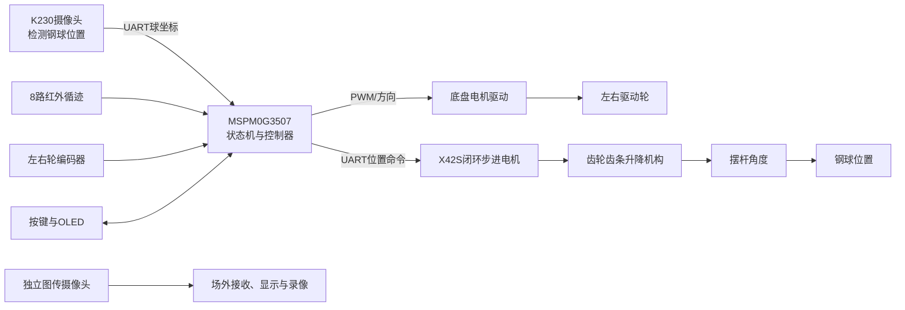
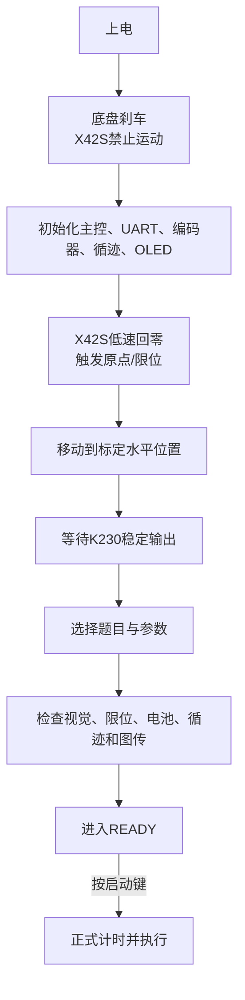

# H题：车载平衡滚球运动控制系统——总体方案与实施总结

> **历史资料，不是当前主工程事实入口。** 当前结论以
> `D:\eletri\项目历程与当前状态.md`、主工程参与编译源码及其SysConfig为准。
> 本文中的旧串口、蓝牙、陀螺仪和T4～T6停车方案不得用于当前工程。

> 本文根据赛题 PDF、`D:\ti_neww` 外设工程、`D:\tttiii` 电机控制工程及现有讨论整理。  
> 目标是形成一份可以直接用于采购、机械设计、软件分工、参数整定和整车联调的执行文档。

## 1. 赛题目标

### 1.1 场地与结构

- 赛道为黑色引导线，线宽 `1.8 ± 0.2 cm`。
- 赛道由两段约 `1.5 m` 直线和两个半径约 `0.5 m` 的半圆组成。
- 一圈长度约为：

  \[
  L = 2\times1.5 + 2\pi\times0.5 \approx 6.14\text{ m}
  \]

- A点设有垂直于赛道的 `5 cm` 起止标志线。
- 小车最大尺寸为 `35 cm × 25 cm`，必须使用车轮驱动和车载电池。
- 循迹传感器必须使用红外光电器件。
- 车上启动按键及显示屏尺寸不得超过 `2 inch`。
- 摆杆使用长 `25 cm` 的四分 PPR 管：
  - 外径约 `2 cm`；
  - 壁厚约 `0.34 cm`；
  - 球为直径 `10 mm` 的钢球；
  - 不允许改变管内凹槽或通过加工改变摩擦特性；
  - 钢球位置必须通过摄像头检测；
  - 左端铰接轴高度 `h ≥ 5 cm`；
  - 摆杆整体必须位于车体范围内。

### 1.2 各题验收要求

| 题目 | 任务 | 关键指标 |
|---|---|---|
| 1 | 车载图传，场外接收、显示并录像回放 | 图像实时稳定；能看清小球和完整摆杆；可保存、回放 |
| 2 | 从A点顺时针行驶一圈并停止在A点 | 用时不超过 `20 s`；停车误差不超过 `2 cm` |
| 3 | 小车静止，小球从O点到 `+5 cm`，再反向到 `-5 cm` 并稳定 | 总时间不超过 `5 s`；两目标点最大绝对误差不超过 `1 cm` |
| 4 | 从A点出发，经B点，球保持在O点 | A到B不超过 `8 s`；球偏差不超过 `±1 cm` |
| 5 | 从A点出发完成一圈，球保持在O点 | 一圈不超过 `30 s`；球偏差不超过 `±1 cm` |
| 6 | 球保持在任意指定位置，小车完成一圈 | 一圈不超过 `30 s`；球偏差不超过 `±1 cm` |

## 2. 推荐总体方案

### 2.1 核心方案

最终推荐采用：

- 主控制器：`MSPM0G3507`
- 球位置视觉：`K230/K230D + 摄像头`
- 摆杆执行器：`X42S闭环步进电机 + 齿轮齿条`
- 摆杆左端：固定铰接轴
- 摆杆右端：齿条升降，并通过滚轮、球头连杆或长孔连接补偿圆弧运动
- 小车驱动：现有直流减速电机、编码器和差速底盘
- 循迹：现有8路红外灰度模块
- 人机界面：现有OLED和4个按键
- 图传：独立模拟或数字FPV链路，不占用主控制闭环



### 2.2 为什么推荐X42S而不是310电机

310带编码电机经过齿轮齿条后，位置分辨率足够，理论上能够实时响应；但需要额外完成：

- 大电流H桥或电机驱动器选型；
- 编码器接口和方向判断；
- 电流、堵转和反转保护；
- 电机位置内环；
- 机械间隙与刹车处理；
- 参数整定和一致性测试。

X42S闭环步进电机内部已经完成电流环和位置闭环，主控只需通过UART发送位置命令，能够显著降低驱动电路和底层控制工作量。因此本项目优先选择X42S。

但X42S不能解决以下机械问题：

- 齿条导向不良；
- 齿轮齿条间隙；
- 摆杆右端圆弧轨迹与齿条直线轨迹冲突；
- 断电后位置未知；
- 限位、回零和机械卡死；
- 电机重量、功耗、振动和发热。

## 3. 现有工程资源

### 3.1 `D:\ti_neww` 中已确认的软件资源

现有工程中已经出现或支持以下模块：

| 模块 | 已有资源或参数 |
|---|---|
| MCU | MSPM0G3507 |
| 底盘电机 | MG513X，12V，约1:28减速比 |
| 编码器 | 13 PPR霍尔AB相；四倍频后每输出轴转约1456计数 |
| 车轮 | 直径约65 mm |
| 电机驱动 | TB6612示例代码 |
| 循迹 | 8路灰度/红外模块 |
| OLED | SSD1306，I2C0，PA28/PA31，400 kHz |
| 按键 | KEY1 PA15、KEY2 PB27、KEY3 PB23、KEY4 PA29 |
| 陀螺仪 | UART0，PB0/PB1，115200 bit/s |
| K230通信 | 部分工程使用UART2，PB15/PB16，115200 bit/s |
| 蓝牙 | UART3，PB2/PB3 |
| 左右轮控制 | PWM PA12/PA13；左QEI PA26/PA27；右编码器PA14/PA25 |
| X42S | UART1，PA8/PA9，115200 bit/s |
| 调试器 | J-Link |

> 不同示例工程的部分引脚存在差异或复用，最终必须以新工程的 `.syscfg` 为唯一引脚真值，并逐项检查冲突。

### 3.2 现有K230视觉通信协议

现有协议帧格式：

```text
A5 5A | CMD | LEN | PAYLOAD | CHECKSUM
```

- 校验：`CMD + LEN + PAYLOAD` 的累加和。
- 目标信息命令：`0x81`。
- 目标载荷共10字节：

| 字段 | 类型 | 说明 |
|---|---|---|
| `error_x_px` | int16 | 横向像素误差 |
| `error_y_px` | int16 | 纵向像素误差 |
| `width_px` | uint16 | 目标宽度 |
| `height_px` | uint16 | 目标高度 |
| `confidence` | uint8 | 置信度 |
| `seq` | uint8 | 帧序号 |

本题建议把与摆杆长度方向一致的坐标作为球位置原始量，再通过两点或多点标定转换为毫米：

\[
x_{mm}=a\cdot u_{px}+b
\]

如果透视畸变较明显，应使用单应性映射或分段标定，不要只使用整幅图统一像素比例。

### 3.3 `D:\tttiii` 中的310电机控制资源

现有工程中的相关参数：

- 电机额定转速约 `450 RPM`；
- 减速比约 `20:1`；
- 编码器13线，AB相四倍频；
- 每输出轴转约 `1040` 个计数；
- 已有20 kHz PWM；
- 已有100 Hz速度闭环；
- 已有主动刹车、反向保护和堵转检测；
- 现有PID是底盘速度环，不是摆杆位置环，不能直接作为滚球控制器使用。

## 4. 机械结构设计

### 4.1 摆杆轴是什么

摆杆轴就是摆杆左端的铰接转轴。摆杆围绕该轴上下转动，改变管道倾角，使钢球受到沿摆杆方向的重力分量，从而左右滚动。

设计要求：

- 轴线稳定，不能明显晃动；
- 轴承或轴套摩擦要小；
- 摆杆轴线与车体横向垂直关系应固定；
- 左端轴高满足 `h ≥ 5 cm`；
- 摆杆水平时应有可重复标定的机械零位。

### 4.2 齿轮齿条行程估算

摆杆有效长度按 `L = 250 mm` 估算。当最大倾角取 `±5°` 时，右端高度变化为：

\[
y=L\sin\theta=250\sin5^\circ\approx21.8\text{ mm}
\]

因此：

- 从水平位置向上或向下至少需要约 `21.8 mm`；
- 上下总理论行程约 `43.6 mm`；
- 考虑回零、装配、缓冲和误差，建议齿条有效行程不小于 `60 mm`；
- 机械绝对限位建议略大于软件工作区，但不得允许摆杆超出安全角度。

### 4.3 右端连接不能完全刚性固定

摆杆右端绕左端轴运动时走圆弧，而齿条只做竖直直线运动。在 `5°` 时，右端水平方向位移约为：

\[
\Delta x=L(1-\cos5^\circ)\approx0.95\text{ mm}
\]

如果齿条顶部与摆杆完全刚性锁死，会产生侧向力、卡滞和回差。推荐按优先级选择：

1. 齿条顶部滚轮托住摆杆；
2. 使用带球头的短连杆；
3. 使用允许约1～2 mm水平补偿的长孔连接；
4. 不推荐完全刚性铰死。

### 4.4 必须具备的机械保护

- 齿条独立直线导轨，不能依靠电机轴承承受全部侧向力；
- 上、下限位开关；
- 上电回零开关或专用原点开关；
- 软件角度限制；
- 机械硬限位和缓冲垫；
- 齿轮齿条轻度预紧或消隙；
- 紧急停止后摆杆不会砸落；
- 走线不拉扯齿条和摄像头。

## 5. AS5600与陀螺仪的作用

### 5.1 AS5600

AS5600是12位非接触磁编码器：

- 测量范围：`0°～360°`；
- 分辨率：4096份/圈；
- 理论角度分辨率约 `0.088°/LSB`；
- 常用I2C地址：`0x36`；
- 在转轴端部安装径向磁铁即可测量摆杆绝对角度。

它可以直接测量摆杆实际角度，不依赖电机内部位置，因此能发现：

- 齿轮齿条回差；
- 连接松动；
- 电机失步或传动打滑；
- 回零偏移；
- 摆杆与电机指令不一致。

第一版使用X42S时可以暂不安装AS5600，但建议PCB和机械结构预留接口。若后续发现角度重复性不足，再加入AS5600作为外部角度校验。

### 5.2 陀螺仪能否代替AS5600

不建议只用陀螺仪测量摆杆角度：

- 陀螺仪积分会漂移；
- 小车加减速和转弯时，加速度计倾角会被车体运动干扰；
- 现有工程主要解析航向角和Z轴角速度，不是摆杆俯仰角；
- 传感器若安装在车体上，只能测车体姿态，不能直接得到摆杆相对车体角度。

陀螺仪更适合作为辅助量：

- 小车航向稳定；
- 转弯动态补偿；
- 摆杆角速度D项辅助；
- 判断整车异常振动。

## 6. 采购清单

### 6.1 必购件

| 类别 | 名称 | 数量建议 | 关键要求 | 用途 |
|---|---|---:|---|---|
| 主控 | MSPM0G3507开发板 | 1+1备份 | 与现有工程兼容 | 整车主控 |
| 视觉 | K230/K230D开发板 | 1 | 有摄像头接口和UART | 钢球识别 |
| 摄像头 | K230兼容摄像头 | 1+1备份 | 帧率建议30～60 FPS | 球位置检测 |
| 摆杆电机 | X42S闭环步进电机 | 1 | TTL串口版本优先；确认额定电压、电流 | 摆杆驱动 |
| 传动 | 与X42S轴匹配的小齿轮 | 1～2 | 模数与齿条一致 | 驱动齿条 |
| 传动 | 齿条 | 1 | 有效行程至少60 mm | 右端升降 |
| 导向 | 小型直线导轨或双导杆 | 1套 | 低间隙、低阻力 | 齿条导向 |
| 限位 | 微动开关/光电限位 | 3 | 上限、下限、原点 | 回零与保护 |
| 摆杆 | 25 cm四分PPR管 | 多根备选 | 规格符合题目 | 正式摆杆 |
| 球 | 10 mm钢球 | 多个 | 尺寸一致 | 正式滚球 |
| 铰接 | 小轴、轴承/轴套、支架 | 1套 | 低间隙、低摩擦 | 摆杆左端 |
| 底盘 | 车架、车轮、万向轮/随动轮 | 1套 | 总尺寸不超过限制 | 小车机械平台 |
| 驱动 | 底盘直流减速电机带编码器 | 2+1备份 | 左右一致性好 | 差速行驶 |
| 电机驱动 | 额定电流足够的双路驱动器 | 1+1备份 | 连续和峰值电流留足余量 | 底盘电机 |
| 循迹 | 8路红外灰度模块 | 1+1备份 | 数字/模拟接口与方案匹配 | 黑线检测 |
| 图传 | FPV摄像头、发射端、接收端 | 1套 | 低延迟、稳定 | 题目1 |
| 显示录像 | 场外显示器和录像设备 | 1套 | 能实时显示、保存和回放 | 题目1 |
| 电源 | 动力电池 | 2～3组 | 容量、放电倍率满足电机峰值 | 整车供电 |
| 电源 | 5V/3.3V稳压模块 | 若干 | 为主控、K230和传感器供电 | 逻辑电源 |
| 电源 | 电源开关、保险丝、急停 | 1套 | 分路保护 | 安全 |
| 交互 | 小于2英寸OLED | 1 | SSD1306优先 | 菜单与状态 |
| 调试 | J-Link或兼容调试器 | 1 | 支持MSPM0 | 下载调试 |

### 6.2 建议采购或预留

| 名称 | 建议原因 |
|---|---|
| AS5600模块和配套磁铁 | 测量实际摆杆角度，排查回差和零位漂移 |
| 备用X42S或备用310电机 | 比赛期间执行器损坏时快速替换 |
| 电流/电压检测模块 | 诊断低电压、堵转和K230重启 |
| 逻辑分析仪 | 检查K230和X42S的UART协议与时序 |
| 示波器 | 检查PWM、电源纹波和电机干扰 |
| 可调限流电源 | 桌面调试执行机构更安全 |
| 弹簧或配重 | 抵消摆杆自重，降低执行器持续负载 |
| 屏蔽线、磁环、电容和独立稳压 | 降低电机对摄像头、UART和主控的干扰 |

### 6.3 购买前必须核对

- X42S通信版本是TTL、RS485还是CAN，必须与现有驱动代码一致；
- X42S供电范围、额定电流和电源峰值能力；
- 电机轴径、轴型、齿轮孔径和紧固方式；
- 齿轮与齿条模数、压力角一致；
- 底盘电机堵转电流是否超过TB6612能力；
- K230摄像头接口、镜头视场和最短对焦距离；
- 图传是否具有真正的录像和回放能力；
- OLED物理尺寸是否满足不超过2英寸的要求；
- 整车装配后是否仍小于 `35 cm × 25 cm`。

## 7. 软件模块化设计

### 7.1 建议工程分层

```text
Application
├── task_manager       题目选择和总状态机
├── task_1_video       图传检查提示
├── task_2_lap_stop    一圈停车
├── task_3_ball_move   +5 cm到-5 cm
├── task_4_to_b        A到B平衡
├── task_5_lap_center  一圈中心平衡
└── task_6_lap_target  一圈指定位置

Control
├── line_controller    循迹控制
├── chassis_speed      左右轮速度闭环
├── ball_controller    球位置PD
├── motion_profile     目标斜坡和限加速度
├── feedforward        小车加速度前馈
└── safety_manager     故障和降级策略

Service
├── vision_service     K230帧解析、坐标标定、超时
├── stepper_service    X42S命令队列、状态、回零
├── odometry           轮编码器里程
├── line_marker        A线识别和防重复触发
├── ui_service         按键、菜单、OLED
└── telemetry          调试数据输出

Driver
├── motor_driver
├── encoder_driver
├── ir_array_driver
├── uart_driver
├── oled_driver
├── limit_driver
└── optional_as5600
```

### 7.2 实时调度建议

| 周期 | 工作 |
|---:|---|
| 中断即时处理 | 只采集编码器、接收UART字节、更新时间戳、置标志 |
| 1 ms | 系统节拍、按键消抖、超时计数 |
| 10 ms / 100 Hz | 轮速计算、底盘速度闭环、循迹控制 |
| 20 ms / 50 Hz | 视觉数据更新、球位置PD、X42S目标更新 |
| 100 ms / 10 Hz | OLED刷新、状态显示、非关键日志 |

原则：

- 中断中不解析完整协议、不刷新OLED、不阻塞等待电机；
- X42S控制必须从现有阻塞演示改为非阻塞服务；
- 视觉包必须带时间戳和序号；
- 控制器只能使用新鲜的视觉数据；
- 所有状态机每次调用只前进一步，不使用长延时。

### 7.3 模块间数据接口

建议统一使用以下物理量：

| 名称 | 单位 | 说明 |
|---|---|---|
| `ball_position_mm` | mm | 球相对摆杆O点位置 |
| `ball_velocity_mm_s` | mm/s | 滤波后的球速度 |
| `beam_angle_rad` | rad | 摆杆角度 |
| `beam_target_rad` | rad | 摆杆目标角度 |
| `car_speed_mm_s` | mm/s | 小车中心速度 |
| `car_accel_mm_s2` | mm/s² | 小车纵向加速度估计 |
| `track_error` | 归一化值 | 红外循迹偏差 |
| `distance_mm` | mm | 自A点累计里程 |

符号必须在第一天统一：

- 球向车头或指定方向移动时，`ball_position_mm` 为正还是负；
- 摆杆右端升高时，`beam_angle_rad` 为正还是负；
- 左右轮前进PWM方向；
- K230图像坐标与摆杆物理坐标的对应关系。

## 8. 球位置控制模型

### 8.1 近似模型

小角度下，钢球沿摆杆的运动可以近似为：

\[
\ddot{x}=k\theta
\]

理想实心球纯滚动时：

\[
k=\frac{5}{7}g\approx7.0\text{ m/s}^2/\text{rad}
\]

实际系统受到管槽形状、摩擦、视觉延迟、传动回差和安装误差影响，应使用实验辨识得到：

\[
k_{\text{eff}}
\]

### 8.2 PD控制器

定义：

\[
e=x_{set}-x
\]

控制律：

\[
\theta_{cmd}=K_p e-K_d\dot{x}+\theta_{ff}
\]

建议D项使用滤波后的实测球速度，不使用原始误差差分，避免目标切换时产生微分冲击。

离散实现：

\[
v_{raw}[n]=\frac{x[n]-x[n-1]}{\Delta t}
\]

\[
v_f[n]=\alpha v_f[n-1]+(1-\alpha)v_{raw}[n]
\]

建议：

- 控制周期：`20 ms`；
- K230实际帧率：尽量稳定在 `30～60 FPS`；
- 使用真实帧时间间隔计算速度；
- 滤波系数初值：`\alpha = 0.6～0.85`；
- 视觉丢帧时不要重复把旧坐标当成新测量。

### 8.3 通过一个参数计算各题PD

固定阻尼比：

\[
\zeta=0.9
\]

只调一个参数：

\[
T_s=\text{期望稳定时间}
\]

二阶系统参数：

\[
\omega_n\approx\frac{4}{\zeta T_s}
\]

\[
K_p=\frac{\omega_n^2}{k_{\text{eff}}}
=\frac{16}{k_{\text{eff}}\zeta^2T_s^2}
\]

\[
K_d=\frac{2\zeta\omega_n}{k_{\text{eff}}}
=\frac{8}{k_{\text{eff}}T_s}
\]

因此，在确定 `k_eff` 后，只需调节 `T_s` 就可以同时生成 `Kp` 和 `Kd`。

### 8.4 `k_eff`辨识方法

1. 小车固定不动，球放在O点附近；
2. 摆杆施加 `+1°` 或 `+2°` 的固定角度；
3. 记录短时间内球位置，拟合初始加速度 `a_plus`；
4. 对称施加 `-1°` 或 `-2°`；
5. 拟合初始加速度 `a_minus`；
6. 计算：

\[
k_{\text{eff}}=
\frac{a_{plus}-a_{minus}}
{2\theta_{test}}
\]

其中角度必须转换为弧度。使用正、负对称测试可以减小零位误差和恒定摩擦偏置的影响。

### 8.5 各题参数换算

设基础稳定时间为 `T_base`，基础参数为 `Kp_base`、`Kd_base`。各题使用：

| 题目 | 稳定时间倍率M | `Kp/Kp_base` | `Kd/Kd_base` | 用途 |
|---|---:|---:|---:|---|
| 3 | 0.8 | 1.5625 | 1.25 | 静止车体，快速换点 |
| 4 | 1.0 | 1.000 | 1.000 | A到B动态平衡 |
| 5 | 1.1 | 0.826 | 0.909 | 一圈中心平衡，偏稳健 |
| 6 | 1.1 | 0.826 | 0.909 | 一圈指定位置，偏稳健 |

换算关系：

\[
T_{task}=M T_{base}
\]

\[
K_{p,task}=\frac{K_{p,base}}{M^2}
\]

\[
K_{d,task}=\frac{K_{d,base}}{M}
\]

实际比赛更推荐先让题目3～6共用一组可靠PD，再通过以下参数适配不同题目：

- 球目标位置斜坡速度；
- 摆杆最大允许角度；
- 小车速度和加速度；
- 小车加速度前馈；
- 球偏差过大时的底盘降速。

这样比维护四组独立PD更容易稳定。

### 8.6 角度限制与前馈

建议初始限制：

- 题目3：摆杆控制角度限制在 `±4°`；
- 题目4～6：限制在 `±3°`；
- 机械绝对安全范围：不超过 `±5°`。

小车加速时，球会受到等效惯性力，可加入近似前馈：

\[
\theta_{ff}\approx\tan^{-1}\left(\frac{a_{car}}{g}\right)
\]

前馈符号必须通过低速实车实验确定。加速度估计必须滤波，并对前馈角度限幅，不能直接使用噪声很大的轮速二次差分。

## 9. 每个题目的整体逻辑

### 9.1 通用上电流程



注意：回零、视觉预热和预平衡应在正式按下启动键之前完成，避免占用比赛计时。

### 9.2 题目1：图传、显示、录像

流程：

1. 独立图传摄像头固定在能同时看清完整摆杆、钢球和刻度的位置；
2. 上电检查接收画面；
3. 正式开始前启动录像；
4. 保证运动过程中画面不黑屏、不严重花屏；
5. 完成后停止录像并现场回放；
6. 每次测试单独保存视频，避免覆盖。

关键点：

- 图传链路与K230视觉链路独立；
- 摄像头支架需抗振；
- 画面必须能判断钢球实际位置，而不只是看到车体；
- 正式测试前检查存储空间、电池和录像指示。

### 9.3 题目2：一圈后停在A点

状态机：

```text
READY
  → ACCEL
  → TRACK
  → FINISH_LINE
  → STOP_OFFSET
  → BRAKE
  → DONE
```

实现要点：

1. 启动后使用限加速度曲线加速；
2. 通过8路红外进行循迹；
3. 离开A点前禁止把起始线误判为终点；
4. 累计里程达到合理阈值，例如超过 `5 m` 后，才允许识别终点A线；
5. 识别A线后继续行驶一个标定补偿距离；
6. 提前减速，最后主动刹车；
7. 记录停车误差并修正 `STOP_OFFSET`。

工程目标：

- 一圈控制在约 `17～19 s`；
- 内部停车目标按 `±1 cm` 调试，为正式要求留余量；
- A线识别必须有防抖和防重复触发。

### 9.4 题目3：O点到+5 cm，再到-5 cm

状态机：

```text
READY_CENTER
  → MOVE_TO_POSITIVE_50
  → POSITIVE_REACHED
  → MOVE_TO_NEGATIVE_50
  → NEGATIVE_STABLE
  → DONE
```

实现要点：

1. 启动前将球稳定在O点附近；
2. 目标不能瞬间从0跳到+50 mm，应使用目标斜坡；
3. 球进入 `+50 mm ±5 mm` 且速度较小后，判定第一次到达；
4. 立即把目标平滑切换到 `-50 mm`；
5. 球进入 `-50 mm ±5 mm` 并连续稳定一定时间后完成；
6. 最大摆杆角度限制在约 `±4°`；
7. 总时间按不超过 `4 s` 调试，为正式5 s留余量。

“到达”不应只看一次位置采样，建议同时满足：

- 位置误差小于阈值；
- 球速小于阈值；
- 连续保持100～300 ms。

### 9.5 题目4：A到B，球保持O点

流程：

1. 启动前把球稳定在O点；
2. 按键后正式计时；
3. 小车使用S形或限加速度方式起步；
4. 循迹和底盘速度环维持稳定行驶；
5. 球控制器保持目标 `0 mm`；
6. 小车加速度前馈抵消起步惯性；
7. 通过编码器累计里程判断到达B点，标定距离约为 `1500 mm`；
8. 到达B点时锁存用时，再安全减速停车。

工程目标：

- A到B控制在约 `6～7 s`；
- 球位置内部目标控制在 `±7 mm`；
- 不要为追求最快速度使用过大的起步加速度。

### 9.6 题目5：一圈，球保持O点

流程：

1. 启动前球稳定在O点；
2. 限加速度起步；
3. 循迹控制完成直道和弯道；
4. 球目标始终为 `0 mm`；
5. 球误差增大时动态降低底盘速度；
6. 累计里程超过阈值后使能A线终点识别；
7. 通过A线完成计时，然后平滑停车。

建议：

- 一圈目标时间 `24～27 s`；
- 球位置内部目标 `±7 mm`；
- 弯道、起步和制动是重点测试工况；
- 若球偏差超过预警阈值，先降速，不要继续维持最高车速。

### 9.7 题目6：一圈，球保持任意指定位置

在题目5基础上增加目标位置设置：

1. 使用按键选择球目标位置；
2. 建议范围先限定在 `-10 cm～+10 cm`；
3. 调整步长建议 `0.5 cm`；
4. 启动前先将球稳定到目标点；
5. 球进入目标 `±5 mm` 后才允许进入READY；
6. 正式启动后执行与题目5相同的一圈控制；
7. 全程目标为选定位置，不自动回O点。

至少测试：

```text
-8 cm、-5 cm、0 cm、+5 cm、+8 cm
```

靠近摆杆端部时应自动缩小允许角度和最高车速，给机械限位留出安全距离。

## 10. 底盘控制

### 10.1 控制结构

建议采用串级结构：

```text
红外循迹误差
    ↓
循迹PD产生左右轮差速
    ↓
左右轮目标速度
    ↓
左右轮速度PI/PID
    ↓
PWM与方向
```

球平衡控制与循迹控制同时运行，但通过速度调度互相协调：

- 球误差小：正常速度；
- 球误差接近预警阈值：降低车速和加速度；
- 球误差接近失控阈值：进一步减速；
- 视觉丢失或球超范围：停车保护。

### 10.2 循迹参数随速度调度

可以使用经验型初始缩放：

\[
K_{p,line}(v)=K_{p,ref}\frac{v_{ref}}{v}
\]

\[
K_{d,line}(v)=K_{d,ref}\frac{v_{ref}}{v}
\]

该公式只能作为起点。直道、弯道、传感器安装高度和电机差异都会影响最终参数，必须实车验证。

### 10.3 A线和B点判断

- A线：红外阵列出现与普通黑线明显不同的横向覆盖模式；
- 离开起点后设置最短时间或最短里程屏蔽；
- 一圈任务在累计里程超过约5 m后再允许A线触发；
- B点：优先使用轮编码器累计约1.5 m判断；
- 所有标志判定均使用连续采样和防抖；
- 计时点、检测点和最终停车点必须分别定义。

## 11. X42S控制流程

### 11.1 上电回零

X42S不应假设断电后仍知道绝对位置。推荐流程：

1. 上电保持底盘刹车；
2. 低速向原点方向运动；
3. 触发原点开关；
4. 停止并反向退出少量距离；
5. 再次低速接近，提高重复精度；
6. 把该位置设为机械参考；
7. 移动到摆杆水平标定位置；
8. 进入READY。

### 11.2 实时命令

现有X42S命令以串口帧发送。115200 bit/s下，一帧约13字节时，线上的发送时间约：

\[
t\approx\frac{13\times10}{115200}\approx1.13\text{ ms}
\]

建议：

- 球控制周期为20 ms；
- 每20 ms最多发送一次新的位置目标；
- 新命令只在目标变化超过最小阈值时发送；
- 发送过程使用非阻塞状态机或中断/DMA；
- 新的安全停止命令应能抢占普通位置命令；
- 不在控制循环中等待电机完成运动。

### 11.3 执行器验收

在接入球控制前，先单独测试：

- `0° → +1° → 0° → -1°`；
- `0° → +3° → -3° → 0°`；
- 每20 ms更新小幅位置命令；
- `±1°` 和 `±3°` 响应时间最好小于 `50～100 ms`；
- 角度超调尽量小于 `0.5°`；
- 连续工作时不丢命令、不撞限位、不明显发热；
- 断电重启后必须重新回零。

## 12. 故障保护

以下任一条件发生时进入故障状态：

- KEY4急停；
- 红外循迹线丢失；
- K230数据超过300 ms未更新；
- 视觉置信度过低；
- X42S通信或驱动故障；
- 上下限位异常触发；
- 底盘电机堵转；
- 电池电压过低；
- 球接近摆杆危险端区；
- 状态机运行超时。

推荐故障动作：

1. 底盘立即降PWM并主动刹车；
2. 停止比赛计时并锁存故障码；
3. 停止X42S普通运动命令；
4. 条件允许时缓慢回水平，否则保持安全位置；
5. OLED显示故障来源；
6. 必须人工确认后才能重新开始。

## 13. 三人模块化分工

### 13.1 A组员：底盘、循迹和停车

负责：

- 底盘机械装配；
- 左右电机驱动和编码器；
- 轮速闭环；
- 8路红外循迹；
- A线识别；
- B点里程判定；
- 一圈速度规划；
- 题目2。

交付接口：

```text
chassis_set_speed(left_mm_s, right_mm_s)
chassis_set_linear_angular(v_mm_s, w)
chassis_get_distance_mm()
chassis_brake()
line_get_error()
line_marker_a_detected()
```

验收：

- 低、中、高三档速度均能稳定循迹；
- 一圈里程重复性满足停车标定；
- 题目2能够在20 s内、2 cm内完成。

### 13.2 B组员：视觉、摆杆和滚球控制

负责：

- K230钢球识别；
- 像素到毫米标定；
- UART协议；
- X42S非阻塞控制；
- 限位和回零；
- 球位置速度估计；
- PD与前馈；
- 题目3；
- 为题目4～6提供平衡接口。

交付接口：

```text
vision_get_ball_position_mm()
vision_data_is_fresh()
beam_home()
beam_set_angle_rad()
ball_control_set_target_mm()
ball_control_update()
ball_control_is_stable()
```

验收：

- 球位置静态误差小于3～5 mm；
- 视觉输出无明显跳点，丢球能报警；
- X42S可重复回零并跟随50 Hz位置命令；
- 题目3在5 s内完成。

### 13.3 C组员：系统集成、电源、UI和图传

负责：

- 题目总状态机；
- OLED菜单和按键；
- 电源分配、保险和急停；
- 故障管理；
- 图传显示、录像与回放；
- 数据记录；
- 题目4～6整车集成；
- 比赛操作流程和备件。

交付接口：

```text
task_select()
task_start()
task_stop()
safety_raise_fault()
ui_show_status()
telemetry_log_sample()
```

验收：

- 启动前检查流程完整；
- 故障能够安全停车并显示原因；
- 图传画面稳定且可回放；
- 题目4～6可以通过菜单独立启动。

### 13.4 共享文件管理规则

- `main.c` 和 `.syscfg` 只能由指定集成人员合并；
- 在接口确定前不要多人同时修改同一文件；
- 模块通过头文件定义接口，不直接访问其他模块内部全局变量；
- 所有物理量必须带单位；
- 每天集成一次经过独立验收的功能；
- 每次合并后至少跑一遍静态检查、编译和基础台架测试。

## 14. 详细实施步骤

### 阶段0：冻结方案与接口

- [ ] 确认X42S具体通信版本和供电规格；
- [ ] 确认底盘电机、驱动器和电池；
- [ ] 确认最终引脚表，无UART、PWM、编码器和限位冲突；
- [ ] 冻结球位置、摆杆角度和电机方向的符号；
- [ ] 冻结K230到MSPM0的数据帧；
- [ ] 确定每个模块负责人。

验收：形成一张最终接线表和一份接口头文件草案。

### 阶段1：机械与电气单元测试

- [ ] 完成摆杆轴、齿条导轨和非刚性右端连接；
- [ ] 安装上限、下限和原点开关；
- [ ] 验证摆杆总行程和 `±5°` 机械安全范围；
- [ ] 分开测试逻辑电源、K230电源、底盘动力和X42S动力；
- [ ] 检查急停和保险；
- [ ] 测试电机启动时主控和K230不复位。

验收：执行机构在无球状态下连续往返，无卡滞、无撞限位。

### 阶段2：底盘闭环

- [ ] 校准每个轮子的编码器计数与实际距离；
- [ ] 调好左右轮速度环；
- [ ] 调好低速循迹；
- [ ] 增加中高速和弯道参数；
- [ ] 实现A线识别和一圈防误触；
- [ ] 完成题目2。

验收：连续5次完成一圈，时间和停车误差均有稳定余量。

### 阶段3：视觉测量

- [ ] 固定摄像头和补光；
- [ ] 识别钢球并过滤反光、管边缘和车体干扰；
- [ ] 完成O点、±5 cm及端点标定；
- [ ] 输出毫米位置、置信度、帧号和时间；
- [ ] 测量端到端延迟和帧率；
- [ ] 实现丢球和陈旧数据检测。

验收：在摆杆全工作范围内，静态误差小于3～5 mm，动态输出无明显跳点。

### 阶段4：X42S与摆杆

- [ ] 完成非阻塞串口驱动；
- [ ] 完成回零状态机；
- [ ] 完成角度到步数/位置命令换算；
- [ ] 完成软件角度限制；
- [ ] 完成限位抢占和急停；
- [ ] 验证50 Hz小步进目标跟随。

验收：摆杆角度重复性满足控制要求，连续运行不发散、不撞限位。

### 阶段5：静止滚球控制

- [ ] 辨识 `k_eff`；
- [ ] 设定 `ζ = 0.9`；
- [ ] 通过 `T_s` 生成基础PD；
- [ ] 从小角度、低增益开始；
- [ ] 调整速度滤波；
- [ ] 加入目标斜坡、角度限幅和稳定判定；
- [ ] 完成题目3。

验收：至少连续5次在5 s内完成，±5 cm处误差均小于1 cm。

### 阶段6：整车动态平衡

- [ ] 小车低速直线时保持球在O点；
- [ ] 加入限加速度启动；
- [ ] 试验并加入小车加速度前馈；
- [ ] 球误差过大时联动降速；
- [ ] 依次完成题目4、题目5；
- [ ] 增加目标位置设置并完成题目6。

验收：按题目4→5→6的顺序逐级通过，不跳过低风险工况直接高速测试。

### 阶段7：比赛化与压力测试

- [ ] 连续运行多轮，统计成功率；
- [ ] 更换满电、半电电池测试；
- [ ] 强光、暗光和反光条件测试；
- [ ] 测试丢线、丢球、通信中断和限位；
- [ ] 检查电机、驱动器和稳压模块温升；
- [ ] 检查录像、回放和存储空间；
- [ ] 固化正式参数并保留一套稳健备用参数；
- [ ] 制作比赛操作卡。

验收：完整模拟正式流程，操作人员不连接电脑也能完成全部题目。

## 15. 推荐调参顺序

必须按以下顺序调试，避免多个环路互相影响：

1. 无球时验证X42S方向、角度和限位；
2. 固定小车，标定K230球位置；
3. 固定小车，辨识 `k_eff`；
4. 调整球速度滤波；
5. 固定小车，调题目3的基础PD；
6. 锁定球PD，不再频繁更改；
7. 单独调底盘速度闭环；
8. 单独调低速循迹；
9. 小车低速直线运行，测试球平衡；
10. 加入小车加速度前馈；
11. 调题目4；
12. 降低激进程度并调题目5；
13. 在多个目标点验证题目6；
14. 最后才提高速度、缩短时间。

每次只改变一个主要参数，并记录：

```text
日期、题号、电池电压、车速、加速度限制、
T_s、Kp、Kd、滤波系数、角度限幅、
最大球误差、完成时间、是否成功、异常现象
```

## 16. 主要风险与对策

| 风险 | 影响 | 对策 |
|---|---|---|
| 齿条与摆杆刚性冲突 | 卡滞、回差、失控 | 滚轮、球头或长孔补偿圆弧运动 |
| X42S上电零位未知 | 摆杆撞限位 | 每次上电自动回零 |
| 视觉延迟和跳点 | PD振荡 | 高帧率、时间戳、置信度、滤波和超时 |
| 球位置D项噪声 | 摆杆抖动 | 使用滤波球速而非原始误差差分 |
| 起步加速度过大 | 球快速偏离 | S形加速、前馈、球误差降速 |
| 车轮打滑 | B点和A点里程误差 | A线校正、平滑速度、重复标定 |
| TB6612电流不足 | 发热、压降、复位 | 按堵转电流重新核对驱动器 |
| 电机干扰K230/主控 | 丢帧、重启 | 电源分路、去耦、布线、磁环和共地检查 |
| 摆杆端部安全余量不足 | 球撞端或掉落 | 目标范围限制、动态角度限制和紧急降速 |
| 多人同时改共享文件 | 集成冲突 | 接口先行，`main.c/.syscfg`由集成人员管理 |

## 17. 最小可行版本与升级顺序

### 第一版：先实现能跑

- MSPM0G3507；
- K230视觉；
- X42S齿轮齿条；
- 原点和上下限位；
- 8路红外循迹；
- 编码器底盘；
- 独立图传；
- 固定一组可靠球PD；
- 题目3、2、4、5、6依次实现。

### 第二版：提高稳定性

- 增加AS5600实际摆杆角度；
- 增加电压、电流监测；
- 增加弯道速度调度；
- 优化加速度前馈；
- 视觉透视校正；
- 齿条消隙和摆杆配重；
- 自动保存每次测试参数和结果。

## 18. 赛前检查表

### 机械

- [ ] 车体尺寸符合限制；
- [ ] 摆杆、钢球规格正确；
- [ ] 左端轴高符合要求；
- [ ] 摆杆在车体范围内；
- [ ] 齿条无卡滞、无明显松动；
- [ ] 所有螺钉、联轴器和齿轮已紧固；
- [ ] 上下限位和原点可靠；
- [ ] 备用钢球、PPR管、齿轮和紧固件齐全。

### 电气

- [ ] 电池满电并有备用；
- [ ] 主控、K230和图传供电稳定；
- [ ] 急停有效；
- [ ] 驱动器温度正常；
- [ ] UART连接可靠；
- [ ] 电机运行时无主控复位和摄像头黑屏。

### 软件

- [ ] 正确选择题号；
- [ ] X42S已回零并回到水平位置；
- [ ] K230数据新鲜、置信度正常；
- [ ] O点和正负方向正确；
- [ ] A线、B点和一圈里程标定正确；
- [ ] 正式参数与备用稳健参数已保存；
- [ ] KEY4急停测试通过。

### 图传

- [ ] 画面能看清完整摆杆、钢球和刻度；
- [ ] 接收显示稳定；
- [ ] 录像已开始；
- [ ] 存储空间足够；
- [ ] 测试完成后可立即回放。

## 19. 最终结论

本题最稳妥的路线是：

1. 使用K230只负责钢球位置视觉；
2. MSPM0G3507负责全部实时控制和题目状态机；
3. 使用X42S闭环步进电机和齿轮齿条控制摆杆右端；
4. 通过限位和回零解决断电位置未知；
5. 通过非刚性右端连接解决圆弧与直线运动冲突；
6. 球控制采用“模型计算PD + 一个稳定时间参数 `T_s` + 实验辨识 `k_eff`”；
7. 题目3～6优先共用一组可靠PD，通过目标斜坡、角度限制、底盘速度和前馈适配；
8. 按“机械/电气→底盘→视觉→摆杆→静止滚球→动态整车”的顺序联调；
9. 先保证稳定成功率，再逐步压缩时间。

只要机械传动无卡滞、视觉延迟稳定、X42S可以50 Hz接收小位置命令，并严格控制小车加速度，这套方案具备完成全部题目的可行性。
